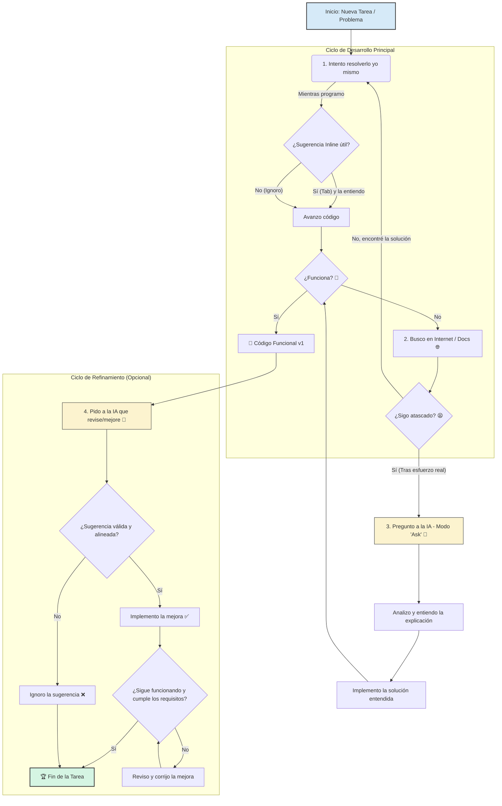

# Programación Multimedia y Dispositivos Móviles 2026

Materiales y prácticas de Programación Multimedia y Dispositivos Móviles (PMDM). Trabajaremos el desarrollo de aplicaciones Android con Kotlin y Jetpack Compose, incluyendo estado, navegación, persistencia y consumo de APIs, y una introducción al desarrollo de videojuegos.

Para empezar, sigue la [guía de configuración del entorno](T00.md).

## Índice de contenidos

> [!NOTE]
> Este curso parte del material de 2025, que se irá actualizando progresivamente. Tanto el orden de los temas como sus contenidos pueden cambiar a lo largo del curso; este índice es provisional.

- [T00 · Configuración del entorno](T00.md)
- [T01 · Tecnologías para dispositivos móviles](T01.md)
- [T02 · Introducción a Kotlin](T02.md)
- [T03 · Primeros pasos en Android Studio](T03.md)
- [T04 · Estado y entrada de datos](T04.md)
- [T05 · Componentes de interfaz y mensajes](T05.md)
- [T06 · Listas con desplazamiento](T06.md)
- [T07 · Ciclo de vida y arquitectura MVVM](T07.md)
- [T08 · Navegación](T08.md)
- [T09 · Listas, tarjetas y temas](T09.md)
- [T10 · Coroutines, Room y DataStore](T10.md)
- [T11 · Intents y APIs con Retrofit](T11.md)
- [T12 · Firebase y publicación de aplicaciones](T12.md)
- [T13 · Introducción al desarrollo de videojuegos](T13.md)

## Créditos

El material del curso es una adaptación personal del material original del profesor **Jose Antonio López de Merlo**. ¡Muchas gracias por compartirlo! 

A partir de dicho material se elaboró ya en 2025 una primera versión para esta misma asignatura, disponible en [https://github.com/scontreraslopez/pmdm-2025](https://github.com/scontreraslopez/pmdm-2025). Y de aquellos polvos, estos lodos.

## Uso legítimo y ético de la IA en la asignatura de PMDM

En la asignatura de Programación Multimedia y Dispositivos Móviles (PMDM), se permite el uso de herramientas de inteligencia artificial (IA) para apoyar el aprendizaje y la resolución de problemas, siempre que se utilicen de manera ética y responsable. A continuación, se detallan las directrices para el uso legítimo de la IA en esta asignatura.

### Nuestro objetivo

En esta asignatura (y en vuestra carrera) el objetivo no es "entregar código que funcione". El objetivo es **convertiros en desarrolladores competentes y crecer como profesionales**: profesionales que entienden lo que hacen, por qué lo hacen y son capaces de razonar sobre su propio código o el de sus pares.

La Inteligencia Artificial es la herramienta más potente que ha llegado a nuestra profesión en décadas. Usada correctamente, os hará más productivos y os ayudará a aprender más rápido. Usada incorrectamente, **secuestrará vuestra oportunidad de aprender**. Es precisamente esta tentación su mayor riesgo y peligro.

Este documento no es para prohibir la IA; es para enseñaros a usarla como lo haría un profesional senior. Nótese que esto también pasaba antes de la IA, copiando y pegando código de StackOverflow o GitHub sin entenderlo, pero ahora es mucho más fácil caer en esa trampa.

*Queremos ser desarrolladores que saben qué hace su código y por qué funciona. Cada fragmento que incorporas debe ser una oportunidad para aprender y una decisión que puedas explicar.*

### Directrices para el uso legítimo de la IA

* **Como un "Autocompletar" avanzado, el modo copiloto:**
    Trabaja con la **finalización de código inline** activada. Si te sugiere exactamente lo que ibas a escribir (y lo entiendes), dale a `Tab`. Has ahorrado 5 segundos. Si no es lo que buscas o no entiendes la sugerencia, ignórala (o investígala) y sigue escribiendo. **Tú tienes el control del código que escribes.**

* **Como apoyo para pensar y aprender:**
    Intenta plantear tú el problema antes de pedir una solución. Puedes usar la IA desde el principio para aclarar conceptos, pedir ejemplos o solicitar pistas. Si te atascas, explica qué has intentado y dónde está tu dificultad. **Pide primero la ayuda mínima que te permita seguir avanzando por tu cuenta.** Antes de incorporar una solución, comprueba que puedes explicarla y adaptarla.

    **No te quedes con la duda:** si una solución utiliza una herramienta, una función o un enfoque diferente al que usarías tú, pregunta: *"¿Por qué has elegido esta opción y no esta otra? ¿Qué ventajas e inconvenientes tiene cada una?"*. Contrasta la explicación con tu propuesta; no des por hecho que la opción de la IA es mejor.

* **Como un Revisor de Código (Code Reviewer):**
    ¿Ya tienes tu código funcionando? ¡Genial! Ahora, pregúntale a la IA: *"¿Hay algo que pueda mejorar en este código? ¿Es eficiente? ¿Sigue las buenas prácticas de Kotlin?"*. Analiza sus sugerencias y aplica **solo aquellas que tengan sentido para ti** y para los objetivos de la práctica. La IA no siempre tiene la razón o el contexto completo.

* **Como Asistente de Documentación:**
    Una vez que tu código esté listo, puedes pedirle ayuda para documentarlo. PERO, tu responsabilidad es añadir el **"porqué"** (la intención de diseño), no solo el "qué".
  * **IA (El "Qué"):** `// Función que suma dos enteros.`
  * **Tú (El "Porqué"):** `// Usamos un Long para evitar un overflow si la suma es muy grande.`

* **Prioriza comprender y decidir:**
    Mientras estés aprendiendo, utiliza preferentemente el modo «Preguntar» (Ask) para pedir pistas, explicaciones y comparar alternativas. Si utilizas el modo «Agente», revisa los cambios, comprueba su funcionamiento y asegúrate de poder justificarlos. **El modo que elijas no sustituye tu participación: tú debes seguir razonando y tomando las decisiones.** Respeta siempre los límites de uso de IA que establezca cada práctica.

* **Dándole el Contexto Adecuado:**
    La IA no es adivina. Si le preguntas algo sin contexto, te dará una respuesta genérica. Usa la función `@` (por ejemplo, `@file:MiArchivo.kt`) para añadir al *prompt* los archivos específicos con los que estás trabajando. Así, su respuesta será relevante para tu proyecto.

* **Scaffolding:**
    Ya antes de la IA había muy buenas herramientas de scaffolding (generación de código base), porque para la gente ya ducha en el desarrollo escribir *boilerplate* consume mucho tiempo y aporta muy poco valor. Por citar algunas *Yeoman*, *Java Hipster*, *Spring Initializr*, etc. La IA puede generarte un esqueleto de proyecto para comenzar a desarrollar, yo también lo uso mucho para no pegarme una semana haciendo las mismas cuatro pantallas. Consejos aquí: modifica las dependencias para usar el stack con el que estás cómodo, revisa las versiones de las librerías y ... simplifica el código generado: La IA tiende a generar código muy genérico y complejo, con muchos detalles, que en general no es lo que queremos. **No olvides que es tu responsabilidad entenderlo y adaptarlo a tus necesidades**.

    **Distingue lo repetitivo de lo que estás aprendiendo.** Puedes apoyarte en la IA para generar estructura cuando la práctica lo permita y esa estructura no sea el contenido que estamos evaluando. Por ejemplo, si el ejercicio consiste en aprender a construir una pantalla en Compose, construirla forma parte de tu trabajo de aprendizaje. Lo que para un desarrollador experimentado es rutinario puede ser precisamente lo que tú necesitas practicar.

---

### La línea roja: lo que nunca debes hacer

Solo hay una regla inquebrantable, y es la más importante:

> **Bajo ningún concepto "planches el enunciado" en la IA y pegues la salida sin entender lo que te da.**

**¿Cómo puedes comprobar que lo entiendes?** No basta con leer la explicación y que te resulte familiar. Debes poder explicar las decisiones del código, modificarlo ante un requisito nuevo y resolver un ejercicio similar sin IA. Si no puedes, identifica qué parte te falta por comprender y sigue trabajando sobre ella.

Pegar una solución sin entenderla puede permitirte completar una entrega, pero deja pendiente el aprendizaje que esa práctica pretendía conseguir.

**¿Por qué es tan grave?**

1. **Secuestra tu aprendizaje:** Te roba la oportunidad de desarrollar tu lógica, tu capacidad de análisis y tu habilidad para depurar.
2. **Genera "Código Zombie":** Producirás código que no entiendes. Si falla (y fallará), no sabrás arreglarlo. Si te piden modificarlo, no sabrás por dónde empezar.
3. **Limita tu autonomía:** Si delegas siempre el análisis y la resolución, practicas menos esas habilidades. Necesitas ejercitarlas para poder avanzar también cuando no tengas IA disponible.
4. **Nos vuelve invisibles:** Si no entiendes el código que has producido, te será muy difícil defenderlo o discutirlo con otros. La falta de comprensión te deja vulnerable a críticas y te impide aprender de tus errores. También te hace temeroso de proponer cambios o mejoras, ya que no te sentirás seguro de cómo afectarán al sistema en su conjunto. No crecerás como profesional.

---

### Cómo usarla en Android Studio

No hay necesidad de sufrir copiando y pegando retales de código en ChatGPT, Android Studio lo tiene ya integrado.

Aquí tienes unas instrucciones sencillas:

> [!WARNING]
> Aviso a navegantes: En el examen no hay internet, por lo que no podréis usar la IA. Este documento es para las prácticas y el aprendizaje.

---

### Conclusión

La IA es una herramienta, no un sustituto de tu capacidad. Trátala como el asistente increíblemente rápido que es, pero no olvides que necesita supervisión constante.

El desarrollador eres tú. La responsabilidad es tuya. El aprendizaje es tuyo.

---
