# T00 · Configuración para Trabajar con GitHub y Android Studio

En este curso vamos a trabajar con GitHub para gestionar las entregas y Android Studio como entorno de desarrollo integrado (IDE) para programar en Kotlin y desarrollar aplicaciones Android.

## 0. Requisitos Previos

Deberemos tener los siguiente prerequisitos instalados y configurados en nuestro equipo:

- Android Studio (última versión estable recomendada)
- Una cuenta de GitHub (gratuita)
- Git (última versión estable recomendada)
- Java Development Kit (JDK) 17 o superior

## 1. Configuración de GitHub - Organización

En GitHub trabajaremos con repositorios privados que colgarán de una organización creada por cada alumno para el curso. Deberéis invitarme (**scontreraslopez**) a vuestra organización como colaborador para que pueda revisar vuestras entregas.

Para ello pinchamos sobre la foto de nuestro perfil y luego "Organizations"

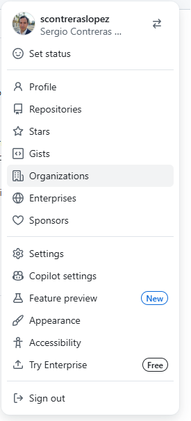

Aquí le damos al botón "New organization" y seguimos los pasos para crearla. La organización puede ser gratuita (Free) ya que no necesitamos funcionalidades avanzadas de pago.

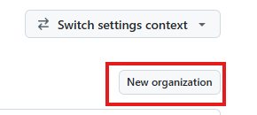

Poner el siguiente nombre y rellenar el resto de campos:

nombreOrganizacion = "Movil"+ $añoactual+ $nombrecompleto sin espacios:

Ejemplo con "Sergio Contreras Lopez" en 2026

Movil2026SergioContrerasLopez

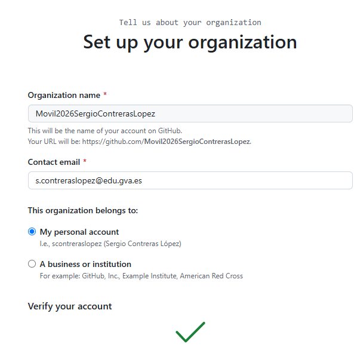

Añadir a continuación la cuenta `scontreraslopez` como colaborador en la organización.

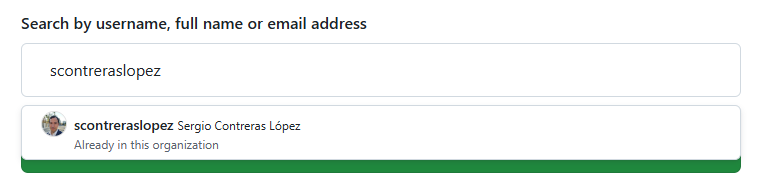

## 2A. Primeros pasos en Android Studio

Abre Android Studio y dale a File -> Settings -> Version Control -> GitHub

**TODO** `placeholder imagen` --> Así no me olvido de añadir la imagen más adelante

Aquí le daremos al símbolo + para añadir nuestra cuenta de GitHub. Elegimos la opción "Log in with Token" y pulsamos sobre el botón "Generate"

**TODO** `placeholder imagen` --> Así no me olvido de añadir la imagen más adelante

Haciendo esto navegaremos a Github, con un Token preconfigurado con los scopes adecuados para Android Studio.
Vamos abajo y le damos a "Generate token"

**Importante**: Copiamos el token a nuestro gestor de contraseñas (KeePass 2, etc) ya que no podremos volver a verlo. Le damos a copiar y volvemos a Android Studio.

Pegamos el Token y le damos a "Add Account". Ahora si todo ha ido bien deberíamos ver nuestra cuenta.

Pulsamos sobre OK.

## 2B. Utilizando github cli desde la terminal (Recomendado 2026)

Github CLI es una herramienta de línea de comandos que nos permite interactuar con GitHub desde la terminal. Es muy útil para crear repositorios, gestionar issues, pull requests y mucho más. [https://cli.github.com/](https://cli.github.com/)

Una vez instalada se puede comprobar que funciona correctamente ejecutando el siguiente comando en la terminal:

```bash
gh version
```

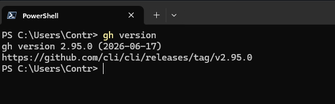

En la consola vamos a logearnos a nuestra cuenta de GitHub usando la cli mediante el siguiente comando:

```bash
gh auth login
```

Seguimos el proceso de autenticación y nos aseguramos de elegir la opción de autenticación con navegador web.

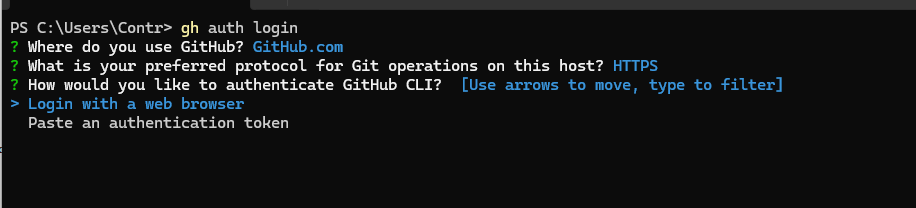

Copiamos el token en el navegador

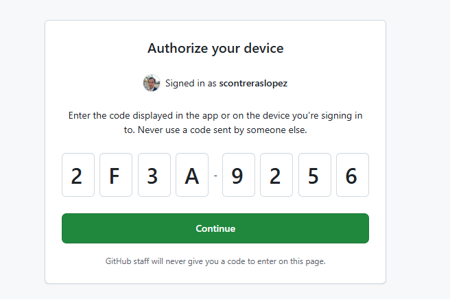

Una vez logeados nos dirá la cli que estamos loggeados correctamente y nos mostrará el nombre de usuario de nuestra cuenta.

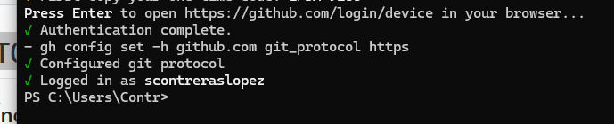

Con el comando `gh auth status` podemos comprobar que estamos loggeados correctamente.

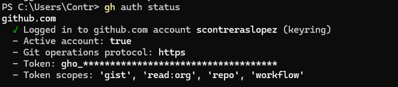

La ventaja de gh cli es que si tenemos varias cuentas de gh es mucho más fácil cambiar entre ellas y trabajar con varias cuentas de gh a la vez. Además, podemos crear repositorios directamente desde la terminal sin necesidad de abrir el navegador. El comando para cambiar de cuenta sería `gh auth switch` y para crear un repositorio `gh repo create`.

Vamos a crear un repositorio de prueba privado dentro de nuestra organización usando la cli. El comando sería:

```bash
gh repo create ${nombreOrganizacion}/prueba-android-studio --private
```

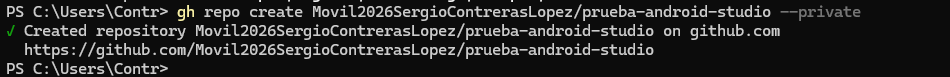

Podemos comprobar que se ha creado correctamente DENTRO de nuestra organización desde el navegador.

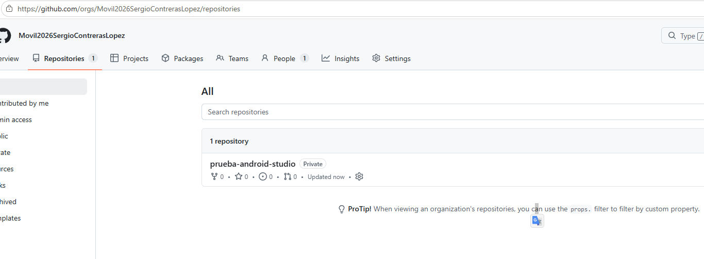

## 3. Creando un repositorio de prueba dentro de la organización

Volvemos a GitHub y navegamos a nuestra organización (Foto Perfil -> Organizaciones -> Movil2025SergioContrerasLopez). Nota también podemos navegar directamente a la organización con la URL: `"https://github.com/organizations/${nombreOrganizacion}/repositories"`

> [!WARNING]
> Asegúrate de estar en la organización correcta y no en tu cuenta personal. Son espacios diferentes.

Desde el apartado de repositories le damos a "New" para crear un nuevo repositorio. Lo llamaremos `prueba-android-studio` y nos aseguraremos que visibility es "Private" (esto es el default).

Ya está creada la organización y el repositorio. Ahora vamos de vuelta a Android Studio.

## 4. Creando un proyecto y lincandolo desde Android Studio

Creamos un nuevo proyecto en Android Studio (File -> New -> New Project). Elegimos "No Activity" y le damos a Next.

Vamos a llamarlo por ejemplo `PruebaAndroidStudio` y le damos a Finish. Nos aseguramos que

- El lenguaje es Kotlin
- La API mínima es 26 ("Oreo")
- La build configuration es "Kotlin DSL (build.gradle.kts)"

Desde la terminal integrada podemos usar gh cli 

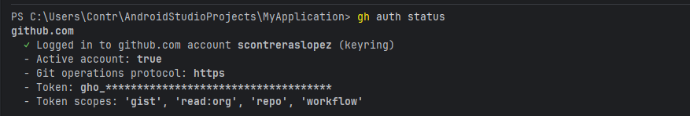

## 5. Enviando el proyecto a GitHub

Lo primero es esperar a que Gradle termine de sincronizar el proyecto (abajo a la derecha). Una vez hecho esto abrimos una nueva terminal dentro de Android Studio y escribimos los siguientes comandos:

```bash
git init
git add .
git commit -m "initial commit"
git branch -M main
git remote add origin https://github.com/${nombreOrganizacion}/prueba-android-studio.git
git push -u origin main
```

Sustituyendo `${nombreOrganizacion}` por el nombre real de vuestra organización. --> Ejemplo: `https://github.com/Movil2025SergioContrerasLopez/prueba-android-studio.git`

Si todo ha ido bien, si navegamos a la URL del repositorio en GitHub deberíamos ver el proyecto que acabamos de subir.
