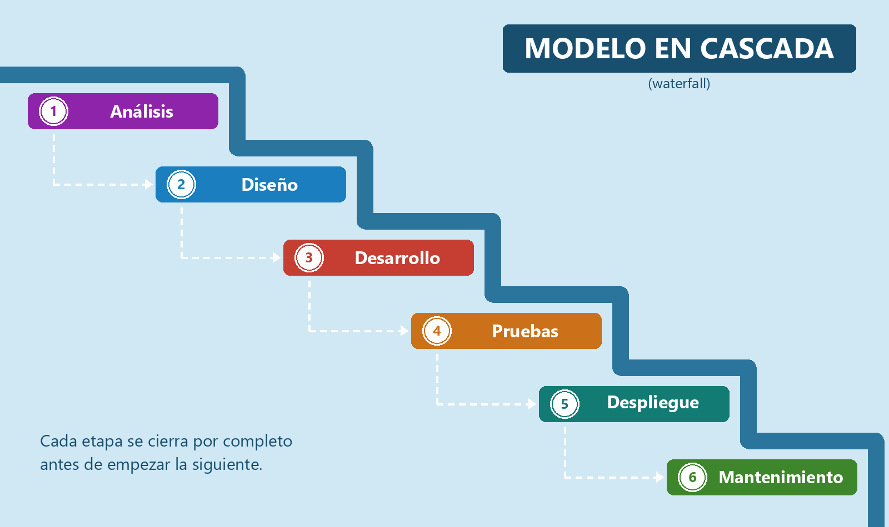
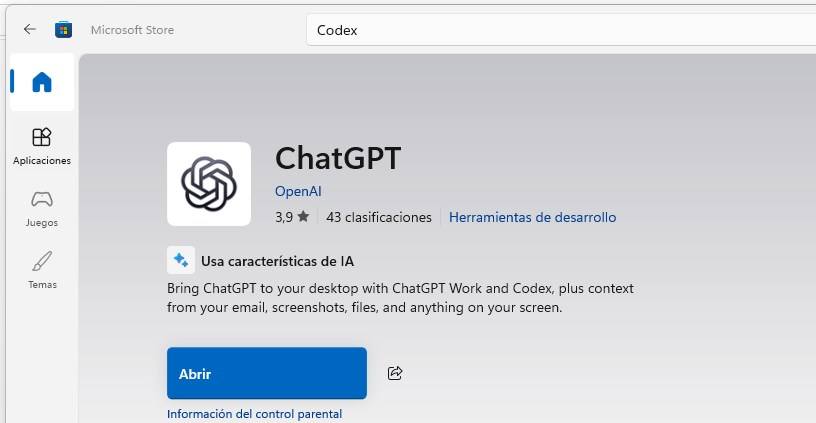
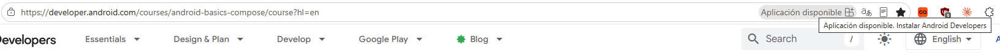

# T01 · Tecnologías para dispositivos móviles

## Índice

* [Desarrollo de aplicaciones Móviles – Metodologías de desarrollo](#desarrollo-de-aplicaciones-móviles--metodologías-de-desarrollo)
  * [Modelo en Cascada (Waterfall)](#modelo-en-cascada-waterfall)
  * [Metodologías Ágiles (Scrum)](#metodologías-ágiles-scrum)
  * [El Híbrido "Scrummerfall" y similares](#el-híbrido-scrummerfall-y-similares)
  * [Particularidades del Desarrollo Móvil](#particularidades-del-desarrollo-móvil)
* [Limitaciones que plantea la ejecución de aplicaciones en dispositivos móviles](#limitaciones-que-plantea-la-ejecución-de-aplicaciones-en-dispositivos-móviles)
  * [1. La Gestión de Recursos: Ser un buen compañero](#1-la-gestión-de-recursos-ser-un-buen-compañero)
  * [2. La Arquitectura del Procesador: Un Mundo Diferente](#2-la-arquitectura-del-procesador-un-mundo-diferente)
  * [3. La Conectividad Intermitente](#3-la-conectividad-intermitente)
  * [4. Un Entorno de Alta Vulnerabilidad](#4-un-entorno-de-alta-vulnerabilidad)
  * [5. El Laberinto de la Fragmentación](#5-el-laberinto-de-la-fragmentación)
  * [6. La Batalla por la Relevancia](#6-la-batalla-por-la-relevancia)
* [Tecnologías disponibles](#tecnologías-disponibles)
  * [Las dos preguntas que clasifican cualquier tecnología móvil](#las-dos-preguntas-que-clasifican-cualquier-tecnología-móvil)
  * [Tabla comparativa de estrategias de desarrollo móvil](#tabla-comparativa-de-estrategias-de-desarrollo-móvil)
  * [Entonces, ¿cuál elijo?](#entonces-cuál-elijo)
* [¿Qué Estudiaremos en Este Módulo?](#qué-estudiaremos-en-este-módulo)
  * [¿Por qué Nativo con Kotlin?](#por-qué-nativo-con-kotlin)
  * [Mención de honor: Kotlin Multiplatform (KMP)](#mención-de-honor-kotlin-multiplatform-kmp)
* [Conclusión](#conclusión)

## Desarrollo de aplicaciones Móviles – Metodologías de desarrollo

El desarrollo de aplicaciones móviles, como cualquier otro proyecto de software, atraviesa las mismas etapas: **análisis → diseño → desarrollo → pruebas → despliegue → mantenimiento**. Esas etapas están siempre ahí; lo que cambia de un enfoque a otro es **en qué orden se recorren y en lotes de qué tamaño**. Esa es toda la diferencia entre las metodologías que veremos a continuación.

No existe un único camino: la metodología "elegida" (a veces impuesta) depende del tipo de proyecto, del cliente y de la cultura de la empresa.

### Modelo en Cascada (Waterfall)

Es el enfoque tradicional y **secuencial**: cada etapa se recorre una sola vez, de principio a fin, y no se avanza a la siguiente sin haber cerrado la anterior. El lote es el proyecto entero. Fue el estándar durante décadas, pero para el desarrollo móvil resulta poco práctico por su rigidez y por su incapacidad de adaptarse a los cambios rápidos que exige el mercado.



**Anécdota.** El modelo nace de un artículo de Winston W. Royce de 1970, *"Managing the Development of Large Software Systems"* —colega ingeniero aeronáutico con el que comparto la afición por la ingeniería de software—. Royce dibujó el esquema secuencial puro, sí, pero fue para decir a renglón seguido que era **arriesgado y que invitaba al fracaso**; el resto del artículo lo dedica a proponer una versión con bucles de realimentación entre fases y con un prototipo previo. La industria se quedó con el primer diagrama y perdió la advertencia por el camino.


El fondo del asunto es que Cascada te permite construir **muy bien** el producto **equivocado**: hay una diferencia fundamental entre hacer las cosas correctas y hacer las cosas correctamente, y un plan cerrado con año y medio de antelación solo puede garantizarte lo segundo.

**Reflexión:**

* Imaginad que os encargan la app de un restaurante de bufé libre de los que sirven a la carta: tarifa plana, pero en lugar de acercaros a las bandejas vais pidiendo plato a plato al camarero, que os lo trae. Pensad bien en cómo funciona ese negocio y decidme cuál creéis que es el punto más débil de desarrollar esa app **en Cascada**.
* A pesar de sus inconvenientes, ¿qué ventaja fundamental creéis que podría ofrecer este modelo en la gestión de un proyecto?
* ¿Quién creéis que trabaja fundamentalmente bajo un modelo en cascada hoy en día? ¿O ya no lo hace nadie?

### Metodologías Ágiles (Scrum)

**Ágil no es Scrum.** *Agile* es el paraguas: valores y principios, los del [Manifiesto Ágil](https://agilemanifesto.org/iso/es/manifesto.html) de 2001 (cuatro valores, doce principios). **Scrum, Kanban y XP** son marcos concretos que implementan esos principios de maneras distintas. Usamos Scrum como ejemplo por ser el más extendido en el sector, pero Kanban reaparecerá un par de epígrafes más abajo.

Scrum es un enfoque **iterativo e incremental**, y el estándar de facto en el desarrollo móvil. En lugar de un único gran lanzamiento, el trabajo se divide en ciclos cortos llamados **Sprints** (de 1 a 4 semanas), al final de los cuales se entrega una versión funcional del software: **el lote deja de ser el proyecto entero y pasa a ser el sprint**. Esto permite lanzar un **Producto Mínimo Viable (MVP)** rápidamente en las tiendas de aplicaciones y mejorarlo continuamente con el feedback real de los usuarios.


*Refresco rápido de lo que ya visteis en Entornos de Desarrollo:* Scrum define tres **roles** — **Product Owner** (decide el qué y prioriza), **Scrum Master** (cuida el proceso y despeja bloqueos) y **equipo de desarrollo** (decide el cómo) — y cuatro **eventos** por sprint: **sprint planning** al empezar, **daily** cada mañana, y al cerrar **review** (se enseña el incremento al cliente) y **retrospectiva** (el equipo revisa cómo ha trabajado). Si alguno de estos siete nombres no os suena de nada, decidlo ahora.

**Reflexión:**

* Una gran empresa os contrata para desarrollar una app con un **presupuesto cerrado**. ¿Qué conflicto surge al aplicar Agile? ¿Y qué le responderíais si os dice que un alcance flexible le suena a "cheque en blanco", frente a la aparente seguridad de firmar precio y alcance por adelantado?
* ¿Cómo evita el equipo que el cliente añada funcionalidades sin control en cada sprint, desvirtuando el proyecto y los plazos?
* En Agile, si el alcance es flexible, ¿cómo demostramos al cliente que el proyecto es un éxito y que su inversión está siendo rentable?

### El Híbrido "Scrummerfall" y similares

Este modelo híbrido nace de la colisión entre equipos de desarrollo ágiles y grandes organizaciones cliente con procesos muy rígidos. Combina una fase inicial de análisis y diseño muy definida (propia de Waterfall) con fases de desarrollo y pruebas que se ejecutan en Sprints (al estilo Scrum). Es un escenario muy común en grandes consultoras, y aunque no es "Agile puro", es una realidad pragmática del sector que debéis conocer, ya que es harto probable que lo acabéis viviendo.

Otro híbrido popular es **"Scrumban"**, que mezcla la estructura de roles y reuniones de Scrum con la flexibilidad y el flujo de trabajo continuo de Kanban. En lugar de Sprints con una duración fija, el equipo trabaja sobre un tablero Kanban, moviendo tareas de una columna a otra a medida que se completan. Este enfoque es ideal para proyectos con prioridades muy cambiantes o para equipos que combinan el desarrollo de nuevas funcionalidades con el mantenimiento y la resolución de incidencias urgentes.

Cuidado aquí con una confusión muy extendida: quitar el sprint **no** es quitar la disciplina, es cambiarla por otra. Lo que sostiene a Kanban es el **límite de WIP** (*work in progress*): cada columna admite un número máximo de tarjetas y, si está llena, no se empieza nada nuevo —hay que ir a desatascar lo que ya está en marcha—. Cuesta bastante más de lo que parece, porque el instinto de cualquier equipo, y sobre todo el de quien lo dirige, es empezar cosas. Un tablero sin ese límite no es Kanban: es una lista de tareas con columnas de colores, y con ella nada se termina nunca del todo. Aunque como imaginarás, la realidad es que muchos equipos se saltan el límite de WIP y acaban con un flujo de trabajo caótico.

El híbrido con nombre propio, manual de instrucciones y certificación oficial se llama **SAFe** (*Scaled Agile Framework*): el intento corporativo de aplicar Agile a decenas de equipos a la vez, con su propia jerga —*Agile Release Train*, *Program Increment*, *PI Planning*— y su propia industria de cursos. Es el marco más extendido en las grandes cuentas y, a la vez, el más discutido del sector: sus críticos sostienen que es Cascada con vocabulario ágil, porque un *Program Increment* de diez semanas planificado al detalle en una sala se parece mucho a un plan cerrado. Lo menciono porque es un nombre que os vais a encontrar en ofertas de empleo.

Yo lo viví de primera mano hacia 2018, en una giga-corporación en Madrid. El argumento era exactamente ese: los proyectos eran demasiado grandes y complejos para un Scrum de manual, así que se adoptó una variante de Scrum a escala y se certificó en ella a buena parte de los gestores de proyecto. Funcionaba mejor que lo que había antes y peor que lo que prometía el folleto, que es probablemente la conclusión honesta sobre cualquier metodología aplicada a escala.

Y existe una versión en miniatura del mismo vicio, que además sufriréis antes que ninguna de las anteriores: el **mini-waterfall dentro del sprint**. Sobre el papel el equipo hace Scrum, pero dentro de cada sprint se repite la cascada entera: análisis el lunes, código hasta el jueves y pruebas el viernes a las seis de la tarde. Es Scrummerfall a escala de dos semanas, con una diferencia que importa: **aquí no os lo impone nadie**. El Scrummerfall clásico viene de fuera, de un cliente o una gerencia que exige el plan cerrado; este se lo hace el equipo a sí mismo, y aparece incluso en organizaciones donde nadie ha pedido fases.

El origen casi siempre es el mismo: partir el trabajo **por capas** en lugar de en vertical. En vez de una historia que atraviese interfaz, lógica y datos y se pueda probar el martes, salen tres tareas —"la pantalla", "el endpoint", "los tests"— que solo encajan al final. De ahí que el remedio también sea distinto: el Scrummerfall de arriba se **negocia** con la organización, mientras que este se **arregla dentro del equipo**. Si no se arregla, el desenlace es siempre el mismo: lo que no da tiempo a probar se acaba probando en producción.

Nótese que términos como "**Scrummerfall**" pueden ser peyorativos, pero representan el hecho de que la realidad es tozuda y muchas veces toca acomodar soluciones de compromiso para que el trabajo salga adelante.

**Reflexión:**

* Viendo que estos modelos no son "ni una cosa ni la otra", ¿qué problemas del mundo real creéis que intentan solucionar los enfoques híbridos?
* Un equipo que intenta trabajar con Sprints (Agile) dentro de una organización que exige un plan cerrado con meses de antelación (Waterfall) puede sufrir mucha frustración. ¿Qué conflictos o tensiones creéis que pueden surgir entre los desarrolladores y la gerencia en un entorno así?

### Particularidades del Desarrollo Móvil

Todo lo anterior valdría igual para un módulo de desarrollo web o de escritorio. Pero en móvil hay dos restricciones que no existen en la web y que condicionan cómo se planifica:

* **No publicáis cuando queréis.** Entre vuestro código y el usuario está la **revisión de la tienda**. Un arreglo urgente puede tardar horas o días en llegar, y eso hay que contarlo en el calendario. En una web se corrige y se sube; aquí no.
* **No decidís cuándo se actualiza.** Aunque publiquéis, el usuario decide si instala. Durante meses convivirán varias versiones de vuestra app, y el servidor tendrá que seguir hablando con todas ellas. En la web solo existe la última versión; en móvil, existen todas.

El oficio tiene respuestas para las dos —canales de prueba, publicar primero para un porcentaje pequeño de usuarios, interruptores para activar funcionalidad sin sacar una versión nueva—, pero eso es materia de **T12**, cuando toque publicar de verdad.

Un aviso, eso sí, para cuando os llegue el momento: **publicar por primera vez en Google Play con una cuenta personal es más difícil de lo que parece**. Antes de que Google os deje siquiera solicitar el acceso a producción, hay que pasar un periodo de pruebas cerradas con un grupo de **probadores voluntarios reales**: gente que se instale la app en su móvil y la mantenga instalada varios días seguidos. Tendréis que reclutar a amigos, familia o compañeros de clase antes de tener nada público. Es la sorpresa que se lleva todo el mundo la primera vez; existe hasta un pequeño mercado de probadores de alquiler.

## Limitaciones que plantea la ejecución de aplicaciones en dispositivos móviles

Desarrollar para móviles no es como hacerlo para un servidor o un ordenador de sobremesa. El entorno móvil presenta un conjunto único de desafíos que debemos conocer y mitigar desde la primera línea de código. No son meras limitaciones, sino las reglas del juego que definen una aplicación de calidad.

### **1. La Gestión de Recursos: Ser un buen compañero**

A diferencia de un PC, un dispositivo móvil funciona con una **batería limitada** y debe compartir memoria y procesador con muchas otras apps. Los sistemas operativos modernos (iOS y Android) son extremadamente agresivos para preservar esa autonomía, llegando a "matar" procesos en segundo plano que consumen demasiado. Nuestra aplicación debe comportarse como un buen "compañero" del sistema: optimizar el código para minimizar el consumo de CPU, gestionar la memoria de forma eficiente y usar las APIs correctas para tareas en segundo plano.


*Pregunta de reflexión: Piensa en una app que hayas desinstalado porque era lenta o agotaba tu batería. ¿Qué te dice eso sobre la tolerancia del usuario ante un mal rendimiento?*

### **2. La Arquitectura del Procesador: Un Mundo Diferente**

Los dispositivos móviles utilizan mayoritariamente procesadores con arquitectura **ARM**, basada en un juego de instrucciones reducido (**RISC**) y diseñada desde el principio para exprimir cada milivatio. Frente a ella, el escritorio ha sido tradicionalmente territorio de **x86/x64**, con un juego de instrucciones complejo (**CISC**). Esa frontera, eso sí, se está borrando: los Mac con Apple Silicon y los portátiles Windows con Snapdragon también son ARM, así que "ARM es lo del móvil" ya no es una regla que se sostenga.

Como desarrolladores de aplicaciones no escribimos ensamblador —entre nuestro Kotlin y el procesador están el compilador y la máquina virtual **ART** (*Android Runtime*), que se encargan de traducir y de optimizar—, así que la arquitectura no condiciona cómo escribimos el código. Nos aparecerá, eso sí, en dos sitios muy concretos:

* **El emulador.** Va fluido cuando la imagen del sistema coincide con la arquitectura de vuestro ordenador, y se arrastra cuando no, porque entonces hay emulación por software de por medio. Android Studio ya elige la imagen adecuada por vosotros, así que basta con no llevarle la contraria.

  

* **El tamaño de la descarga.** El fichero que todos conocéis es el **`.apk`**, el que se instala en el móvil. Pero a Google Play ya no se sube un `.apk`, sino un **`.aab`** (*Android App Bundle*), que no es instalable: es un paquete con todo dentro —el código para cada arquitectura, los recursos para cada tamaño de pantalla, los textos en cada idioma— del que **Play fabrica al vuelo el `.apk` concreto que necesita cada dispositivo**. Así el usuario no se descarga nada que su móvil no vaya a usar.

### **3. La Conectividad Intermitente**

Un móvil está en constante movimiento, pasando de una red Wi-Fi de alta velocidad a 5G, 4G, o a una **desconexión total** al entrar en un túnel. Una aplicación que asume una conexión estable está destinada a fallar, creando una experiencia de usuario frustrante. Por ello, debemos diseñar con una mentalidad **offline-first**: guardar datos en local (caché) para que la app siga siendo funcional sin conexión y sincronizar la información cuando la conexión se restablezca.

Ojo, que el problema **no es binario**. Pensar en términos de "hay red o no hay red" deja fuera el caso más frecuente de todos: **hay red, pero es mala**. Latencia altísima en una zona con una raya de cobertura, ancho de banda de risa en un tren, o **datos móviles que el usuario paga** y que quizá tenga limitados con el ahorro de datos activado. Una app que solo contempla los dos extremos se comporta fatal en todo el terreno intermedio, que es justo donde vive la gente.

Os pongo un caso que sufro personalmente. Estoy en el parking subterráneo de un centro comercial, en otra ciudad, y quiero dejar puesta la ruta a casa antes de arrancar. Waze me dice **"no hay red"** y ahí se acaba la conversación: no me deja ni buscar la dirección. Así que salgo del parking sin navegador, me paro en cualquier sitio en cuanto tengo cobertura, y ahí busco la dirección. Y la pregunta es evidente: **¿por qué no me deja escribirla igualmente y encolar la búsqueda para cuando haya red?** La app tiene mi teclado, tiene mi historial y tiene mi casa guardada; lo único que le falta es la respuesta del servidor, que podría esperar treinta segundos.

Ese es el patrón que debéis interiorizar: **la falta de conexión no debería bloquear la intención del usuario**, solo retrasar su ejecución. Dejarle expresar lo que quiere, guardarlo y sincronizarlo cuando se pueda. Cuando una app os corte en seco con un "sin conexión", preguntaos siempre si de verdad necesitaba la red **en ese preciso instante** o si es que nadie pensó en el caso.

Y que no os engañe el nombre que haya detrás. De estos fallos hay a montones en aplicaciones de compañías enormes, con equipos de producto grandes, presupuestos que ya quisiéramos y toda la inteligencia artificial del mundo a su disposición. Y es que la IA os escribirá el código, pero **no decide por vosotros qué debe hacer la app cuando no hay red**: eso es una decisión de diseño, y sigue siendo cosa de quien piensa el producto. Ahí es donde se distingue una app buena de una app que simplemente funciona cuando todo va bien.


Y no es teoría lejana: el *offline-first* es literalmente lo que construiréis en este módulo, con **Room** como almacén local (**T10**) y **Retrofit** como origen remoto (**T11**).

*Pregunta de reflexión: ¿Qué esperas que haga una app como Spotify o Google Maps cuando pierdes la cobertura? ¿Cómo impacta en tu experiencia que siga funcionando o que se bloquee por completo?*

### **4. Un Entorno de Alta Vulnerabilidad**

Los móviles son inherentemente más vulnerables: se conectan a redes Wi-Fi públicas, el usuario puede instalar apps de orígenes dudosos y el dispositivo físico puede ser robado. La seguridad, por tanto, no es una opción, sino una obligación. Debemos aplicar el **principio de mínimo privilegio** (solicitar solo los permisos estrictamente necesarios) y **cifrar toda la información sensible**, tanto la que se almacena en el dispositivo como la que se transmite por la red, usando siempre HTTPS.

> [!NOTE]
> Esto queda fuera del alcance de la asignatura, pero es importante entender que el cifrado end-to-end no protege frente a un *endpoint compromise*. Si el dispositivo está comprometido, el atacante puede acceder a los datos ya descifrados y exfiltrarlos, como hacen los *on-device spyware* tipo Pegasus. A diferencia de las películas de la Mafia, no se pincha la red: se pincha el dispositivo.

Android pone dos defensas de serie: el **sandbox**, que aísla cada aplicación de las demás y de sus datos, y el sistema de **permisos**, que no es de todo o nada. Los sensibles —cámara, micrófono, ubicación, contactos— se piden **en tiempo de ejecución** y el usuario puede denegarlos o revocarlos cuando le venga en gana; otros, como el acceso a Internet, se conceden solos al instalar sin preguntar nada. Dicho de otro modo: **cualquier app puede enviar datos fuera del dispositivo sin pedirle permiso a nadie**. Lo veremos en detalle en **T11**.

Pero hay una regla que conviene grabarse antes de escribir la primera línea de código: **el cliente no es de fiar**. Vuestra app se puede descargar del dispositivo y descompilar. Herramientas como **R8** ofuscan el código, pero **no lo protegen**: cualquier clave de API, contraseña o token que escribáis dentro de la app se puede extraer, por bien escondido que os parezca. Todo lo que deba permanecer secreto vive en el servidor, nunca en el dispositivo. Acordaos de esto en **T11** y **T12**, cuando empecéis a manejar claves de APIs y de Firebase, porque es la tentación número uno.

*Pregunta de reflexión: Al instalar una app, ¿sueles revisar la lista de permisos que solicita? ¿Qué te hace desconfiar de una aplicación en este aspecto?*

### **5. El Laberinto de la Fragmentación**

No existe "un" móvil Android; existen miles de modelos con diferentes tamaños de pantalla, resoluciones, procesadores y versiones del sistema operativo. Esta **fragmentación** es un enorme desafío, ya que una interfaz que se ve perfecta en un dispositivo puede estar rota en otro.

La solución es crear interfaces de usuario **adaptables (responsive)** que se ajusten a cualquier pantalla y programar de forma defensiva, comprobando siempre la versión del SO antes de usar una función específica y ofreciendo alternativas para las más antiguas.

Y esto ha dejado de ser un consejo para convertirse en una obligación: las versiones recientes de Android **ignoran** los trucos con los que una app podía negarse a rotar o a cambiar de tamaño en pantallas grandes. Vuestra app se va a redimensionar y a rotar en tablets, plegables y ChromeOS **la hayáis preparado o no**, así que más vale prepararla.

Y la fragmentación no es solo de versiones y de pantallas: también es **de fabricantes**. Cada marca añade su propia capa de personalización, y algunas son tan agresivas cerrando apps para ahorrar batería que existe una web, [dontkillmyapp.com](https://dontkillmyapp.com), dedicada exclusivamente a documentar cómo lo hace cada una. Que tenga que existir os dice bastante del terreno que pisáis.

### **6. La Batalla por la Relevancia**

El espacio en el móvil de un usuario es un terreno muy cotizado y la gente es reacia a instalar nuevas aplicaciones si no ven un valor claro. Yo soy un *hoarder* y el precio se paga con un teléfono que va mucho más lento de lo que me gustaría. Nuestra app compite contra la saturación, el consumo de datos de la descarga y el espacio de almacenamiento que ocupará. Por ello, debe ofrecer un **valor añadido innegable** que justifique su instalación frente a una web móvil (p. ej., acceso al hardware, notificaciones avanzadas, mejor rendimiento) y debemos optimizar al máximo su tamaño para que la descarga sea lo más ligera posible.

El tamaño, de hecho, no es un detalle estético: cada megabyte de más es gente que empieza la descarga y la abandona a medias. A eso ayuda el **Android App Bundle** que veíamos antes, que hace que cada usuario se baje solo lo que su dispositivo necesita.

-----

## Tecnologías disponibles

Para llevar una aplicación a Android y a iOS hay varios caminos, y ninguno es "el correcto". Tradicionalmente, quien fabrica el sistema operativo define un lenguaje y unas herramientas propias para su plataforma: eso es el **desarrollo nativo**. Frente a él han ido apareciendo *frameworks* de **desarrollo multiplataforma**, que permiten escribir una sola vez buena parte del código y publicarlo en varios sistemas.

La distinción sigue siendo útil para entenderse, pero cada año es menos rígida: hoy hay tecnologías que comparten toda la lógica y dejan la interfaz nativa, y otras que comparten absolutamente todo. Así que este apartado no va de elegir bando, sino de **saber qué opciones existen y qué preguntas hay que hacerse** cuando toque decidir.

> [!NOTE]
> Este epígrafe es sobre todo **material de referencia**. No hace falta memorizar versiones, nombres de motores gráficos ni siglas de arquitecturas. Lo que sí quiero que os llevéis es el mapa: qué familias hay, en qué se diferencian y cuándo conviene cada una. El resto está aquí para que podáis volver a ello el día que os haga falta.

Antes de hablar de tecnologías conviene saber sobre qué terreno jugamos. En agosto de 2026, Android e iOS se reparten prácticamente todo el mercado móvil: [StatCounter](https://gs.statcounter.com/os-market-share/mobile/worldwide) da un **67,6 % para Android** y un **32,4 % para iOS** a escala mundial, con cifras muy parecidas en España (68,6 % y 31,4 %). Hagamos lo que hagamos, hay dos plataformas que atender.

> [!IMPORTANT]
> Ese promedio mundial esconde diferencias regionales enormes, y confundirlos es un error clásico al planificar un producto. **En Estados Unidos el reparto se invierte y el iPhone va por delante**, y en Japón ocurre lo mismo de forma aún más marcada. Si vuestro cliente vende sobre todo allí, "empezamos por Android porque tiene más cuota" es una decisión equivocada tomada con un dato correcto. En el enlace de StatCounter podéis cambiar la región y comprobarlo vosotros mismos: merece la pena hacerlo una vez.

**Para ampliar.** Estos tres vídeos no dicen lo mismo, y eso es parte de la lección:

* [Panorama de las opciones actuales de desarrollo móvil](https://www.youtube.com/watch?v=-pWSQYpkkjk) - resumen general de las alternativas.
* [Argumentos a favor del multiplataforma](https://www.youtube.com/watch?v=yye7rSsiV6k) - un análisis con una preferencia clara por esta vía.
* [Philipp Lackner: por qué sigue apostando por Android nativo](https://www.youtube.com/watch?v=fPm4yGATPDM) - mantiene KMP en el radar, pero recomienda esperar a que gane tracción.

No existe una única solución correcta: la elección depende del rendimiento que necesitéis, de la experiencia de usuario que busquéis, del tiempo y el presupuesto que tengáis y, muy especialmente, **del equipo que ya tenéis**. Una empresa con cinco desarrolladores de React no elige lo mismo que una con dos equipos nativos veteranos, aunque el producto sea idéntico. Es importante señalar que cuando una empresa cuando apuesta por una tecnología lo suele hacer pensando a muchos años vista, *¿cuándo el desarrollador rote, quién lo va a mantener?*

### **Las dos preguntas que clasifican cualquier tecnología móvil**

Casi todas las comparativas que encontraréis por ahí mezclan cosas distintas y acaban en una lista de ventajas e inconvenientes que no ayuda a decidir nada. Para **clasificar** (que no es lo mismo que elegir) basta con separar dos preguntas que son **independientes entre sí**:

1. **¿Cuánto código se comparte?** Desde dos aplicaciones prácticamente separadas hasta una única base común para todo.
2. **¿Quién dibuja la interfaz?** Puede dibujarla el *toolkit* oficial del sistema operativo, un *framework* que traduce a componentes nativos, un motor gráfico propio que pinta cada píxel, o directamente un navegador metido dentro de la app.

Son independientes porque se combinan casi como se quiera, y de ahí sale este mapa:


La decisión de un proyecto, por tanto, no es "nativo o multiplataforma": es **decidir qué partes se comparten y qué partes se hacen a medida para cada sistema**.

#### 1. Desarrollo nativo

Utiliza directamente el SDK, las APIs y las herramientas del fabricante de la plataforma.

En **Android**, el stack recomendado hoy es:

* **Lenguaje: Kotlin.** Google mantiene una estrategia *Kotlin-first* y lo recomienda para toda aplicación nueva. Java sigue oficialmente soportado y es interoperable: no está muerto (todavía queda muchísimo código Java en producción), simplemente ya no es por donde se empieza un proyecto nuevo.
* **Interfaz: Jetpack Compose**, el toolkit moderno recomendado por Google, preparado para teléfonos, tablets, plegables y Wear OS. El sistema clásico de *Views* con XML sigue siendo compatible y lo encontraréis en montones de aplicaciones existentes, aunque de nuevo no es la vía recomendada para proyectos nuevos.
* **IDE: Android Studio.**.

En el **ecosistema Apple**:

* **Lenguaje: Swift.**
* **Interfaz: SwiftUI**, que permite reutilizar buena parte de la misma implementación entre iOS, iPadOS, macOS, watchOS y visionOS. UIKit y Objective-C siguen siendo muy relevantes en proyectos ya existentes, de manera similar al caso de Android.
* **IDE: Xcode** y, por tanto, (forzosamente) un Mac.

Fijaos en que **las dos plataformas han hecho la misma apuesta**: de un sistema clásico (Views, UIKit) a uno **declarativo** (Compose, SwiftUI). Declarativo significa que describís *cómo debe verse la interfaz para un estado dado* y el framework se encarga de actualizarla cuando ese estado cambia, en lugar de ir manipulando la pantalla paso a paso. Es el cambio de mentalidad más comoplicado al principio frente a la programación imperativa que venís manejando, aunque si es cierto que guarda fuertes similitudes con el desarrollo web moderno (React, Vue, Angular). Que Apple llegara por su cuenta a la misma solución es la mejor prueba de que no es una moda pasajera de Google. *Nota al margen*: Google es *famoso* por empezar tecnologías y luego *abandonarlas*, como curiosidad hay una web dedicada a esto [https://killedbygoogle.com/](https://killedbygoogle.com/). 

**A favor:** acceso directo a todas las APIs y a las novedades del sistema el día que salen, y máxima fidelidad a las convenciones de cada plataforma.

**En contra:** hay que desarrollar, probar y mantener por duplicado lo que es específico de cada sistema, sobre todo la interfaz. Eso **no** obliga a tener dos repositorios ni a duplicarlo absolutamente todo: el proyecto puede vivir en un **monorepo** y algunas capas pueden compartirse con las tecnologías del punto siguiente.

#### 2. Desarrollo multiplataforma

Bajo este término caben las tecnologías que permiten reutilizar una parte significativa del código entre sistemas operativos. Ojo, que "multiplataforma" **no** significa necesariamente "escribirlo una vez y no volver a tocar código específico": en un proyecto real casi siempre convive código compartido con código propio de Android y de iOS, y la proporción depende del framework y de lo que pida la aplicación.

Si la idea os suena, es porque no es nueva: es el viejo *Write Once, Run Anywhere* (WORA) con el que Java llevaba décadas prometiendo lo mismo, adaptado ahora a las limitaciones del móvil. Conviene recordarlo porque marca el tono: la promesa de escribir una vez y ejecutar en todas partes se ha cumplido siempre **a medias**, y casi nunca en la capa de la interfaz.


**React Native: interfaz compartida sobre componentes nativos.** Se programa en JavaScript o, lo habitual hoy, en **TypeScript con React**, y el framework traduce eso a componentes nativos de cada sistema. Encaja especialmente bien en equipos que ya dominan React y TypeScript.

**Flutter: interfaz compartida con motor gráfico propio.** Usa el lenguaje **Dart** y trae su propio sistema de widgets y su propio motor de dibujo. A diferencia de una app híbrida, **no** renderiza dentro de un WebView: controla directamente el pintado de la interfaz (con su propio motor gráfico, similar a lo que hace Unity). Su gran fortaleza es conseguir una UI idéntica y muy personalizada en todas las plataformas.

**Kotlin Multiplatform (KMP): compartir solo lo necesario.** En lugar de obligaros a compartir toda la aplicación, os deja decidir qué capas son comunes. Lo típico es compartir modelos, reglas de negocio, red, persistencia, validaciones y casos de uso, y mantener dos interfaces distintas: Jetpack Compose en Android y SwiftUI en iOS. Google lo respalda oficialmente para compartir lógica entre Android e iOS y lo considera estable y listo para producción. Es la opción natural cuando se quiere eliminar la duplicación de lógica sin renunciar a que cada app se sienta plenamente nativa.

**Compose Multiplatform: compartir también la interfaz.** Es la vuelta de tuerca de JetBrains sobre lo anterior: construido sobre el modelo de Compose, permite compartir además la UI. Es estable en Android, iOS y escritorio, y está en beta para web. Interopera con SwiftUI y UIKit, lo que hace posible introducirlo poco a poco dentro de una aplicación que ya existe, en vez de reescribirla entera.

Y aquí está la idea que de verdad importa: **Kotlin Multiplatform no es un punto, es un gradiente de posibilidades.** Podéis compartir solo la lógica, o la lógica y algunas pantallas, o casi todo, y moveros por esa línea según lo que pida el proyecto:

```text
Solo la lógica                                    Lógica + interfaz
      │                                                   │
      ▼                                                   ▼
KMP + Compose/SwiftUI  ──────────────────►  Compose Multiplatform
```

**.NET MAUI: la vía del ecosistema .NET.** Permite crear aplicaciones para Android, iOS, macOS y Windows con **C#** y **XAML** desde un proyecto compartido, manteniendo la posibilidad de escribir código específico de cada plataforma. Su sitio natural son las organizaciones cuyo stack ya está construido sobre .NET; rara vez se elige desde cero por motivos puramente técnicos.

#### 3. Aplicaciones híbridas: la web dentro de una app

Una aplicación híbrida usa HTML, CSS y JavaScript dentro de una aplicación instalable, con una capa nativa que le da acceso a las funciones del dispositivo. El stack representativo hoy es **Ionic + Capacitor**:

* **Ionic** aporta los componentes de interfaz. Es compatible con Angular, React y Vue, y también puede usarse sin ninguno de ellos.
* **Capacitor** aporta el contenedor nativo y los *plugins* con los que el código web accede a cámara, GPS, ficheros y demás. Por dentro, esos plugins pueden llevar Swift en iOS y Java o Kotlin en Android.

Quizá oigáis nombrar **Cordova**: fue quien popularizó este modelo y sigue siendo útil para entenderlo, pero hace años que Ionic dejó de usarlo en favor de Capacitor, así que como retrato del presente se queda corto. Esta vía interesa sobre todo cuando ya existe un equipo web con experiencia, o una aplicación web que se quiere reaprovechar a fondo.

En mi experiencia es un stack muy cómodo: desde el mismo proyecto se obtiene, con poco trabajo adicional, la versión web y las apps de Android e iOS. Para escritorio la cosa cambia un poco, Capacitor no tiene soporte oficial, pero como el resultado sigue siendo una web, se puede empaquetar con **Electron**, que la mete junto con su propio navegador en una aplicación de escritorio (le empotra un Chromium y un Node.js). Así lo he hecho yo, aunque también se podría instalar directamente la PWA.

Ejemplo de aplicación empaquetada con Electron: La aplicación de ChatGPT instalada desde la store de Windows.



Ejemplo de PWA: La aplicación de Android Developers.



#### 4. Web móvil y aplicaciones web progresivas (PWA)

Una **web *responsive*** es simplemente un sitio web cuya interfaz se adapta al tamaño y las características del móvil. Se ejecuta en el navegador y no se instala nada. Algunas tienen una experiencia muy cuidada y se comportan casi como una app, pero no pueden acceder a la mayoría de las APIs del sistema ni enviar notificaciones, y dependen de la conexión para funcionar.

Una **PWA** (*Progressive Web App*) añade lo necesario para acercarse a la experiencia de una app instalada: con un *Web App Manifest* obtiene su propio icono y se abre en una ventana independiente del navegador. Muchas usan *service workers* para cachear contenido y funcionar sin conexión. 

Nota: Un *service worker* es un script que el navegador ejecuta aparte de la página, en segundo plano, y que se coloca entre la web y la red: intercepta sus peticiones y puede responder con copias guardadas en caché, de modo que la app, incluida su propia interfaz, se abre aunque no haya conexión. También es el que permite recibir notificaciones *push* con la web cerrada.

Su gran ventaja es la distribución: una PWA se reparte con una URL, se encuentra desde un buscador y no pasa por la revisión de ninguna tienda, con todo lo que eso ahorra según veíamos más arriba.

> [!NOTE]
> *(Para saber más.)*  Si aun así se quiere estar en Google Play, en Android existe la **Trusted Web Activity (TWA)**, que abre el contenido de la PWA a pantalla completa dentro de una app Android. De esta manera se podría empaquetar la PWA y publicarla en la tienda, aunque no es lo habitual: la mayoría de PWAs se distribuyen directamente por la web.

Entre las principales desventajas de las PWAs tenemos:
- Dificultad para acceder a hardware avanzado (cámara, sensores, etc.).
- Descubribilidad limitada. Al final la PWA la instalarán los usuarios que ya te conocen por la web, no los que buscan en la tienda por ejemplo "aplicaciones de recetas de cocina".

### **Tabla comparativa de estrategias de desarrollo móvil**

| | Nativo | Multiplataforma | PWA | Web *responsive* |
| :--- | :--- | :--- | :--- | :--- |
| **Rendimiento** | Máximo | Alto | Medio | Medio |
| **Novedades del SO** | El día que salen | Con retraso, hasta que el framework las expone | Muy limitado | Muy limitado |
| **Acceso al hardware** | Completo | Alto, casi completo | Parcial | Muy limitado |
| **Coste y tiempo** | Alto | Medio | Bajo | Muy bajo |
| **Sensación de app nativa** | Total | De total a discutible, según la vía elegida | Buena | Básica: es una web |
| **Distribución en tiendas** | Sí | Sí | Parcial, vía TWA | No |
| **Funciona sin conexión** | Sí | Sí | Parcial | No |
| **Curva de aprendizaje** | Alta | Media | Baja | Muy baja |
| **Mantenimiento** | Dos bases de código | Una base más los ajustes por plataforma | Una | Una |

Una advertencia sobre esta tabla, porque las comparativas de este tipo se leen mal con facilidad: la columna de multiplataforma **agrupa cosas muy distintas**. KMP con interfaz nativa da una sensación de app idéntica a la nativa, mientras que en una app Flutter se nota, para bien o para mal, que no usa los componentes del sistema. Usadla como orientación, no como sentencia. Y tened en cuenta que compara vías para hacer **aplicaciones**: los juegos siguen sus propias reglas, como veremos a continuación.

### **Entonces, ¿cuál elijo?**

Reglas de bolsillo, que no sustituyen a pensar pero evitan la mayoría de los disgustos:

* **Una sola plataforma, o exigencia máxima de rendimiento e integración con el sistema** (edición de vídeo, cámara, sensores, *wearables*): **nativo**.
* **Un juego**: un **motor de juegos** como **Unity** (C#), **Godot** o **Unreal** (C++). Dibujan con su propio motor directamente sobre la GPU y exportan el mismo proyecto a Android, iOS, escritorio o consolas, así que el rendimiento no obliga a ir a nativo. Programarlo a mano solo se justifica en juegos 2D muy sencillos o como ejercicio para entender el bucle de juego.
* **Hay que llegar a Android y a iOS con poca gente y poco tiempo, y la interfaz puede ser propia**: **Flutter** o **React Native**; entre los dos decide casi siempre el equipo que ya tenéis.
* **Ya hay dos equipos nativos y duele mantener la misma lógica escrita dos veces**: **KMP**, compartiendo la lógica y dejando cada interfaz en su sitio.
* **El producto es contenido, catálogo o una herramienta interna, y lo que importa es que entre todo el mundo sin instalar nada**: **PWA** o web *responsive*.
* **Ya existe una aplicación web y hay equipo web**: **Ionic + Capacitor** antes que reescribirlo todo.

Y una respuesta más honesta que cualquiera de las anteriores: **la tecnología correcta suele ser la que vuestro equipo ya sabe usar**. Un equipo experto en React haciendo React Native llegará a producción antes y con menos errores que ese mismo equipo aprendiendo Kotlin y Swift a la vez, aunque sobre el papel lo nativo "sea mejor".

*Conclusión del apartado:* en 2026 la pregunta ya no es "¿nativo o multiplataforma?". Es **qué código comparto, quién dibuja mi interfaz y cuánto control específico de cada plataforma necesito**.

-----

## ¿Qué Estudiaremos en Este Módulo?

Como acabamos de ver, el abanico de tecnologías es muy amplio. En este curso, nos centraremos en aprender a desarrollar **aplicaciones nativas para el sistema operativo Android con el lenguaje Kotlin con Jetpack Compose**

### ¿Por qué Nativo con Kotlin?

1. **Base Fundamental:** Aprender desarrollo nativo te proporciona los cimientos más sólidos. Entenderás cómo funciona realmente el sistema operativo, la gestión de recursos, el ciclo de vida de una app y las guías de diseño oficiales. Además, muchos conceptos se trasladan a otros frameworks: la interfaz declarativa, en la que la pantalla se describe a partir del estado, es la misma idea en Jetpack Compose, SwiftUI y Flutter, y el patrón MVVM, con su *ViewModel*, se usa en las tres, aunque cada una lo implementa a su manera.

2. **Demanda de Mercado:** Sigue habiendo una gran demanda de desarrolladores nativos puros, especialmente para aplicaciones de alto rendimiento y de grandes empresas.

3. **La Tendencia de Kotlin y el Estado de KMP:** Kotlin es el lenguaje preferido para Android y la base de **Kotlin Multiplatform (KMP)**. Todo lo que aprendáis aquí es directamente reutilizable el día que os toque compartir código con iOS, como veremos justo debajo.

4. **Limitaciones logísticas**: Para iOS se necesita un Mac y Xcode, y no todos los estudiantes disponen de ello. Android Studio es multiplataforma y funciona en Windows, macOS y Linux, lo que facilita el acceso a todos.

### Mención de honor: Kotlin Multiplatform (KMP)

KMP ha alcanzado una fase **estable y lista para producción**, y tanto Google como JetBrains están invirtiendo fuerte en él. Su enfoque es distinto al de Flutter: en lugar de imponer una interfaz común, os deja **elegir hasta dónde compartir**, que es justo el continuo que veíamos antes:

* **Compartir solo la lógica** (datos, red, reglas de negocio) y escribir la interfaz de forma nativa en cada plataforma, con Jetpack Compose en Android y SwiftUI en iOS. Es el uso más extendido con diferencia.
* **Compartir también la interfaz**, con **Compose Multiplatform**: estable en Android, iOS y escritorio, y en beta para web.

**Lo que se contó en la KotlinConf'26** (Múnich, mayo de 2026):

* El número de aplicaciones destacadas que usan KMP **se ha más que duplicado en un año**, y lo construido con KMP sirve ya a cientos de millones de usuarios diarios.
* Nombres propios en producción: **PayPal, Booking.com, Sony y Duolingo**, que se suman a los que ya se citaban antes, como **Netflix, VMware o Forbes**.
* **Compose Multiplatform** es estable en móvil y escritorio; la versión web alcanzó la beta en septiembre de 2025.
* El ecosistema de librerías compatibles ronda ya las **3.600** en klibs.io, frente a unos pocos cientos en 2022. Es el mejor indicador de salud de una tecnología: no lo que promete quien la fabrica, sino cuánta gente ha construido cosas encima.
* Se anunció **Kotlin 2.4**, junto a mejoras de herramientas: compilaciones más rápidas en Kotlin/Native y mejor interoperabilidad con Swift.

¿Ha despegado, entonces? Todavía no tiene la cuota de Flutter ni de React Native, pero ha dejado de ser una promesa. Y lo que más os interesa a vosotros: **lo que vais a aprender en este módulo es la puerta de entrada natural a KMP**.

* [KotlinConf'26 · Keynote](https://www.youtube.com/watch?v=juG8UP3IPZU)
* [Resumen de los anuncios de la KotlinConf'26 · Blog de JetBrains](https://blog.jetbrains.com/kotlin/2026/05/kotlinconf26-keynote-highlights/)
* [KotlinConf'25 · Keynote](https://www.youtube.com/watch?v=Wib6pjJoFzc) — útil para comparar cuánto ha cambiado el discurso en un solo año.

*Noticias Septiembre 2026:*
[https://www.youtube.com/watch?v=muN6vRUsoPA](https://www.youtube.com/watch?v=muN6vRUsoPA): En este video, comentado por *midudev*, se analiza la notica de que Shopify ha decidido abandonar React Native y volver al desarrollo nativo con Swift y Kotlin, apoyándose en IA para acelerar la migración. Tendremos que estar pendiente a ver si hay un cambio de tendencia en el mercado hacia el desarrollo nativo, o si es un caso aislado de una empresa con necesidades muy específicas.


-----

## Conclusión

Como vemos, no hay una respuesta única. Ambas vías, **nativa** y **multiplataforma**, son válidas y tienen su lugar en la industria. Nuestro objetivo en este ciclo, tal como marcan los resultados de aprendizaje del módulo **0489 - Programación multimedia y dispositivos móviles**, es que seáis capaces de:

* **Evaluar las tecnologías disponibles** para dispositivos móviles.
* **Desarrollar aplicaciones** empleando las librerías y herramientas específicas, ya sea para móviles o para juegos 2D y 3D.
* **Integrar contenidos multimedia** y crear interfaces de usuario funcionales y atractivas.
