# T03 · Android Studio: Primeros pasos

## Índice

- [Introducción](#introducción)
- [Descarga e instalación](#descarga-e-instalación)
- [¿Por qué Jetpack Compose?](#por-qué-jetpack-compose)
  - [El sistema de Views](#el-sistema-de-views)
  - [Qué problemas tenía](#qué-problemas-tenía)
  - [Jetpack Compose](#jetpack-compose)
  - [¿Entonces Views ha muerto?](#entonces-views-ha-muerto)
- [Ejercicio 1 (práctica guiada): tu primera app](#ejercicio-1-práctica-guiada-tu-primera-app)
  - [Crear el proyecto](#crear-el-proyecto)
  - [Un vistazo al IDE](#un-vistazo-al-ide)
  - [Qué hay en `MainActivity`](#qué-hay-en-mainactivity)
  - [Tu primer Composable](#tu-primer-composable)
  - [Cambiar el color de fondo con `Surface`](#cambiar-el-color-de-fondo-con-surface)
  - [Añadir un `padding`](#añadir-un-padding)
  - [Ejecutar en el emulador](#ejecutar-en-el-emulador)
- [Ejecutar en un dispositivo físico](#ejecutar-en-un-dispositivo-físico)
  - [Activar las opciones de desarrollador 📲](#activar-las-opciones-de-desarrollador-)
  - [Conectar desde Android Studio 💻](#conectar-desde-android-studio-)
- [Ejercicio 2 (práctica guiada): textos, filas y columnas](#ejercicio-2-práctica-guiada-textos-filas-y-columnas)
  - [Anotaciones: `@Composable` y `@Preview`](#anotaciones-composable-y-preview)
  - [Cómo se llaman los Composables](#cómo-se-llaman-los-composables)
  - [Un texto grande: `sp` y `dp`](#un-texto-grande-sp-y-dp)
  - [Layouts: `Row`, `Column` y `Box`](#layouts-row-column-y-box)
  - [Llevarlo a la app y alinear](#llevarlo-a-la-app-y-alinear)
- [Ejercicio 3 (práctica guiada): imágenes, `Box` y recursos](#ejercicio-3-práctica-guiada-imágenes-box-y-recursos)
  - [Qué es un recurso](#qué-es-un-recurso)
  - [Añadir la imagen al proyecto](#añadir-la-imagen-al-proyecto)
  - [El Composable `Image`](#el-composable-image)
  - [`Box`: apilar elementos](#box-apilar-elementos)
  - [Ajustar la imagen: `contentScale` y `alpha`](#ajustar-la-imagen-contentscale-y-alpha)
  - [Modifiers más a fondo](#modifiers-más-a-fondo)
  - [Strings como recurso](#strings-como-recurso)
- [Ejercicio 4 (práctica libre): practicar Composables](#ejercicio-4-práctica-libre-practicar-composables)
- [Ejercicio 5 (entregable): tarjeta de presentación 🚨](#ejercicio-5-entregable-tarjeta-de-presentación-)
  - [Iconos de contacto: `Icon`](#iconos-de-contacto-icon)
  - [Cómo entregarlo](#cómo-entregarlo)

## Introducción

Para el desarrollo nativo de aplicaciones en Android tenemos un IDE específico para tal tarea. Es gratuito y está basado en IntelliJ. Tenemos versión de instalación para macOS, Windows y Linux. Se trata de **Android Studio**.

Vamos a seguir una serie de tutoriales de Google para introducirnos en Android Studio:
[https://developer.android.com/courses/pathways/android-basics-compose-unit-1-pathway-2](https://developer.android.com/courses/pathways/android-basics-compose-unit-1-pathway-2)

Paralelamente, ir añadiendo [https://developer.android.com/develop/ui/compose/documentation](https://developer.android.com/develop/ui/compose/documentation) a vuestros favoritos porque os va a ser de gran ayuda para explorar las posibilidades de Jetpack Compose.

> [!IMPORTANT]
> **En este tema solo se entrega el [Ejercicio 5](#ejercicio-5-entregable-tarjeta-de-presentación-).**
>
> Los ejercicios 1 a 4 son **prácticas guiadas**: los hacemos paso a paso a partir de los *codelabs* de Google y **no se entregan**. Aun así, hazlos todos y en orden, porque cada uno introduce lo que necesitarás para el Ejercicio 5. Si te los saltas, el 5 se te va a hacer muy cuesta arriba.

> [!NOTE]
> Los manuales en castellano pueden estar desactualizados; si algo no cuadra, sigue la versión en inglés. Además, los *codelabs* no siempre van al día con Android Studio: la plantilla de proyecto que te creará el IDE es algo distinta a la que aparece en ellos. En cada práctica guiada te indico cómo adaptarlo.

## Descarga e instalación

No hay complicaciones para la instalación. Sí que es necesario tener una máquina relativamente potente, pues la emulación de un dispositivo Android no es baladí. Se recomienda tener al menos 8Gb de RAM y un disco SSD.

Las versiones más recientes de Android Studio ya incluyen un JDK (Java Development Kit). Si por alguna razón no lo detecta, el propio instalador te guiará para descargar e instalar una versión compatible, por lo que no es necesaria una instalación previa.

> [!TIP]
> La forma más cómoda de instalar y, sobre todo, de **mantener actualizado** Android Studio es la [JetBrains Toolbox App](https://www.jetbrains.com/toolbox-app/). Desde ella instalas Android Studio con un clic y te avisa de cada nueva versión para actualizar sin tener que descargar y reinstalar a mano. Además, te permite convivir con varias versiones (por ejemplo, la estable y una *preview*) y gestionar desde el mismo sitio el resto de IDEs de JetBrains, como IntelliJ IDEA.

Una cosa interesante es que en Android Studio podemos activar el *soft-wrap*, es decir, que las líneas largas se ajusten al ancho de la ventana. Pulsa `Control + Shift + A`, escribe *soft-wrap* y tendrás el *toggle* `Active Editor: Soft-Wrap` para activarlo o desactivarlo.


## ¿Por qué Jetpack Compose?

Antes de crear nuestra primera app conviene entender por qué el código que vamos a ver tiene la pinta que tiene. Android lleva desde 2008 con un sistema para construir interfaces, el **sistema de Views**, y en 2021 Google lanzó uno nuevo, **Jetpack Compose**, que es el que usaremos en todo el curso.

### El sistema de Views

Durante más de diez años, una pantalla de Android se construía en dos partes:

- Un fichero **XML** con el *layout*: qué widgets hay (`TextView`, `Button`, `ImageView`…) y cómo se colocan.
- Código **Kotlin/Java** en la `Activity` o el `Fragment` que busca esos widgets por su id y los modifica a mano cuando cambian los datos.

Por ejemplo, un contador que muestra cuántas veces se ha pulsado un botón:

Fichero *xml* que define la interfaz gráfica:

```xml
<!-- res/layout/activity_main.xml -->
<LinearLayout
    android:layout_width="match_parent"
    android:layout_height="match_parent"
    android:orientation="vertical">

    <TextView
        android:id="@+id/tvContador"
        android:layout_width="wrap_content"
        android:layout_height="wrap_content"
        android:text="Pulsado 0 veces" />

    <Button
        android:id="@+id/btnPulsar"
        android:layout_width="wrap_content"
        android:layout_height="wrap_content"
        android:text="Pulsa" />
</LinearLayout>
```

Fichero *Java* (o *Kotlin*) que define la lógica de la pantalla:

```kotlin
// MainActivity.kt
val tvContador = findViewById<TextView>(R.id.tvContador)
val btnPulsar = findViewById<Button>(R.id.btnPulsar)
var count = 0

btnPulsar.setOnClickListener {
    count++
    tvContador.text = "Pulsado $count veces" // si se te olvida esta línea, la pantalla miente
}
```

### Qué problemas tenía

- **Dos lenguajes para una sola pantalla.** El XML y el código Kotlin hay que mantenerlos sincronizados a mano: renombras un id y algo se rompe.
- **Actualizar la pantalla es responsabilidad tuya.** Cada vez que cambia un dato tienes que acordarte de actualizar *todos* los widgets que dependen de él. Con pantallas grandes es fácil que la interfaz acabe mostrando algo que no se corresponde con los datos: es la fuente de bugs más típica de las apps con Views.
- **Mucho código repetitivo.** Mostrar una simple lista exige un `RecyclerView` con su `Adapter` y su `ViewHolder`; crear un componente propio reutilizable supone heredar de `View` y lidiar con XML de atributos.
- **Atado a la versión de Android.** Las Views forman parte del propio sistema operativo, así que las mejoras y correcciones llegaban con cada versión de Android y los móviles antiguos se quedaban sin ellas.

### Jetpack Compose

Compose se presentó en 2019 y su versión estable (1.0) salió en julio de 2021. Resuelve esos problemas cambiando el planteamiento:

- **Todo es Kotlin.** La interfaz se escribe con funciones marcadas con `@Composable`; no hay XML de layouts.
- **La interfaz se describe a partir del estado.** No modificas widgets: dices *qué* debe verse para unos datos concretos y, cuando los datos cambian, Compose vuelve a pintar automáticamente lo que haga falta (a esto lo llama **recomposición**). Se suele resumir como **UI = f(estado)**, y es lo que se conoce como **interfaz declarativa**, frente a la **imperativa** de Views, donde das las órdenes de cambio paso a paso.
- **Es una biblioteca, no parte del sistema.** Va dentro de tu app como cualquier otra dependencia de Jetpack, se actualiza a su ritmo y funciona igual en móviles antiguos.

El mismo contador en Compose:

```kotlin
@Composable
fun Contador() {
    var count by remember { mutableStateOf(0) }

    Column {
        Text("Pulsado $count veces")
        Button(onClick = { count++ }) {
            Text("Pulsa")
        }
    }
}
```

Fíjate en que en `onClick` solo se cambia `count`; nadie toca el `Text`. Como el texto se *describe* a partir de `count`, es imposible que se quede desactualizado. Lo de `remember` y `mutableStateOf` lo veremos con calma más adelante; por ahora basta con saber que marcan `count` como **estado** que Compose vigila.

| | Views (clásico) | Jetpack Compose |
| :--- | :--- | :--- |
| **Lenguaje** | XML + Kotlin/Java | Solo Kotlin |
| **Cuando cambian los datos** | Actualizas cada widget a mano | Cambias el estado y Compose repinta |
| **Listas** | `RecyclerView` + `Adapter` + `ViewHolder` | `LazyColumn` |
| **Actualizaciones** | Con cada versión de Android | Como cualquier biblioteca |

Compose no es perfecto. Que sea una biblioteca más (la última fila de la tabla) tiene su contrapartida: tu proyecto depende de muchas piezas cuyas versiones tienen que encajar entre sí. Están Kotlin, el Android Gradle Plugin (AGP), el `compileSdk` y las propias librerías de AndroidX, y además cada versión de Android Studio solo admite AGP hasta cierta versión. Cuando una pieza se adelanta o se queda atrás aparece el temido *dependency hell*, y encontrar una combinación que compile puede costar. Ya lo hemos sufrido juntos en el aula, quienes habéis estado conmigo en presencial. Para suavizarlo existe el **Compose BOM**: con una sola versión alinea todas las librerías de Compose, y lo verás en el `build.gradle.kts` de cualquier proyecto nuevo. Pero subir la versión del BOM tampoco es inocuo: entre las versiones de 2025 y 2026, por ejemplo, el código que usaba el composable `Icon` dejó de compilar. El problema se agrava con las librerías de terceros, que a menudo tardan en adaptarse y cuyas actualizaciones pueden romper código que ya funcionaba.

### ¿Entonces Views ha muerto?

No del todo. Google recomienda Compose para cualquier app nueva y todo lo nuevo nace ahí: los componentes de Material 3, las APIs de Wear OS, TV o widgets, los ejemplos de la documentación y los *codelabs*. El sistema de Views ha pasado a ser **legacy**: se mantiene, pero ya no evoluciona.

Eso sí, hay muchísimas apps en producción escritas con Views, así que en una empresa es muy probable que te toque mantener o migrar código de este tipo. Ambos sistemas pueden convivir en la misma app (Compose dentro de Views y al revés), lo que permite migrar pantalla a pantalla. Si alguna vez ves `findViewById`, un `RecyclerView` o una carpeta `res/layout` llena de XML, ya sabes de dónde viene.

> [!NOTE]
> En este curso trabajaremos exclusivamente con Compose. Cuando busques ayuda en internet, ten cuidado: muchas respuestas antiguas (y algunas de la IA) dan soluciones con Views que no te sirven.

-----

## Ejercicio 1 (práctica guiada): tu primera app

*Práctica guiada, no se entrega.*

Vamos a crear nuestra primera app y ver cómo podemos lanzarla en un emulador o en nuestro móvil real (si es Android). La referencia oficial es el *codelab* [Crea y ejecuta tu primera app para Android](https://developer.android.com/codelabs/basic-android-kotlin-compose-first-app).

Me he hecho eco de las críticas a los *codelabs*: es verdad que están muy bien, pero para una primera vuelta se pueden hacer duros. Así que os dejo a continuación mi versión alternativa, en mi estilo característico, para que os resulte más fácil arrancar.

### Crear el proyecto

Para arrancar los proyectos en Android Studio nos apoyamos en las plantillas que nos ofrece el IDE. Estas plantillas nos crean la estructura de carpetas y ficheros base, así como un código de partida para que podamos arrancar con nuestro proyecto.

Flujo: **New Project -> Phone and large screens -> Empty Activity -> Next**. Elige siempre la plantilla que tenga el logo de *Jetpack Compose*, el cubo ese raro.

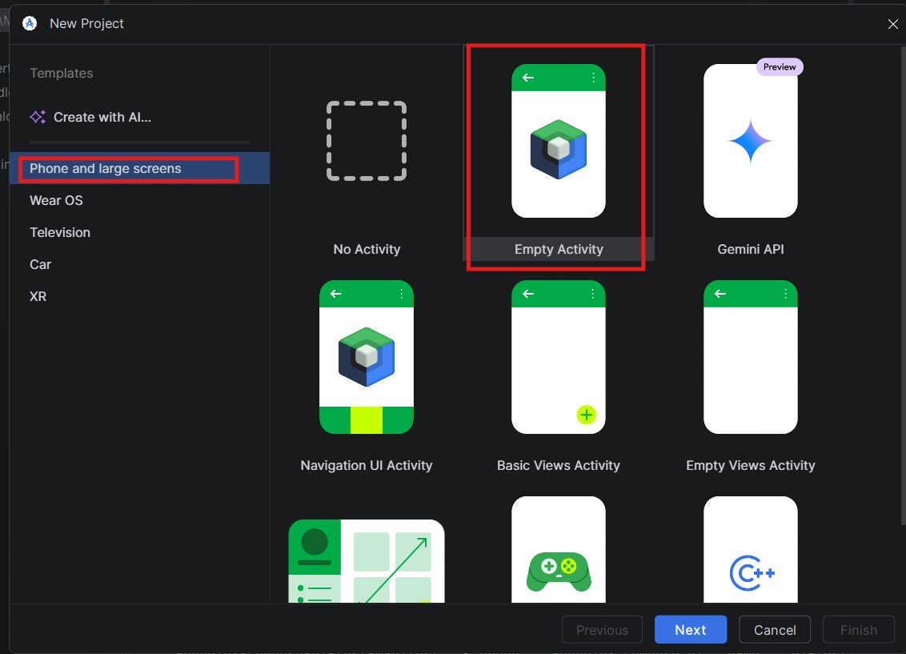

Parámetros:

- **Name**: `T03-ej1`.
- **Package name**: `net.iessochoa.tunombre.t03_ej1`.
- **Save location**: donde quieras guardar el proyecto.
- **Minimum SDK**: API 26 (Android 8.0). Es la versión mínima de Android en la que corre la app. Bajarla mucho hace que la app pueda ejecutarse en más móviles, pero también limita qué APIs podemos usar. Para este curso, con API 26 vamos bien.

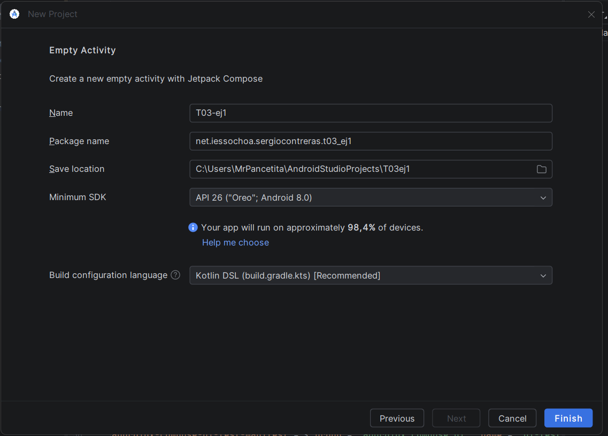

A partir de ahí Gradle empezará a descargar dependencias y a compilar. Ya sabéis, es cuestión de esperar prestando atención a la barra inferior.

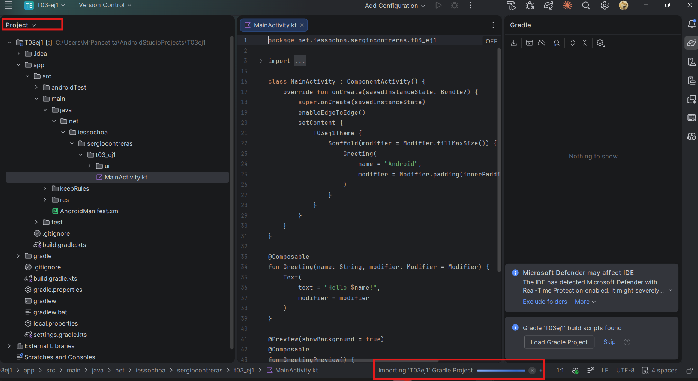

Cuando termine, la vista del panel de proyecto cambiará automáticamente de `Project` a `Android`.

Si durante la descarga y compilación os interesa controlar el progreso, podéis clicar sobre el icono del martillo y veréis la ventana de *Build* con el detalle de lo que está haciendo.

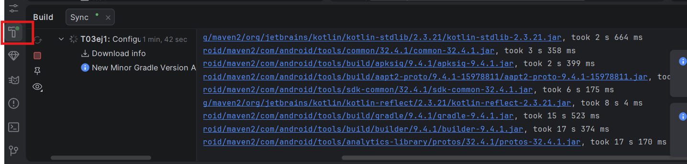

### Un vistazo al IDE

En la esquina superior derecha del editor tenéis sus tres modos, de izquierda a derecha:

- **Code**: muestra exclusivamente el código.
- **Split**: muestra el código y la *preview* de la UI.
- **Design**: muestra exclusivamente la *preview* de la UI.

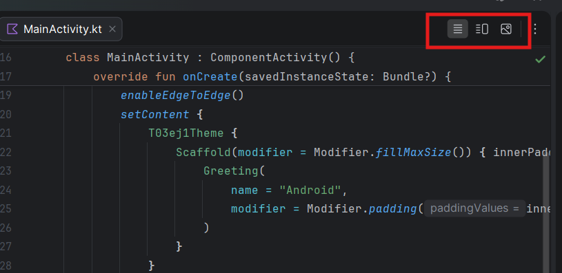

La primera vez que activéis el modo *Split* la *preview* tarda un poco en renderizarse. Si no se ve nada, clicad en el botón *Build & Refresh* que hay en la parte superior de la *preview*. Lo mismo si hacéis un cambio en el código y la *preview* no se actualiza sola.

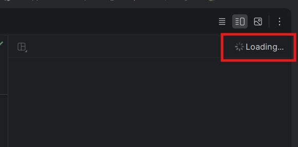

El panel de la izquierda muestra los ficheros del proyecto, y podéis cambiar entre vistas en cualquier momento. Usaremos casi siempre la vista **Android**, que agrupa los ficheros por su función; `Project Source Files` muestra en cambio la estructura real en disco, como en el Explorador de Windows o el Finder.

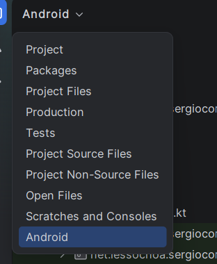

### Qué hay en `MainActivity`

Este es el código que nos genera la plantilla:

```kotlin
class MainActivity : ComponentActivity() {
    override fun onCreate(savedInstanceState: Bundle?) {
        super.onCreate(savedInstanceState)
        enableEdgeToEdge()
        setContent {
            T03ej1Theme {
                Scaffold(modifier = Modifier.fillMaxSize()) { innerPadding ->
                    Greeting(
                        name = "Android",
                        modifier = Modifier.padding(innerPadding)
                    )
                }
            }
        }
    }
}
```

`MainActivity.kt` es el **fichero** de entrada de la app cuando usamos la plantilla. Recuerda que en Kotlin la clase no tiene por qué llamarse como el fichero y que en un fichero podemos tener varias clases, funciones, etc. Dentro tiene una **clase**, `MainActivity`, que hereda de `ComponentActivity`. Una *Activity* es una pantalla de la app; al heredar de `ComponentActivity` nuestra clase recibe todo lo necesario para que Android la gestione y, además, el método `setContent` para pintar su interfaz con Compose.

Dentro de la clase tenemos el método `onCreate()`, que es el punto de entrada de la app, el equivalente al `main()` de Kotlin: al lanzarse la app se ejecuta el `onCreate()` de `MainActivity`. `onCreate()` es un evento del ciclo de vida de la app (*lifecycle*), que estudiaremos con algo más de detalle más adelante en el curso.

Dentro de este método se llama a `setContent()`, que es el punto en el que la app está preparada para recibir la UI con funciones *composables*.

Una **función Composable** es la herramienta clave del paradigma declarativo de Jetpack Compose. Es una función normal de Kotlin con la anotación `@Composable` delante, que le dice al compilador que Compose la usa para generar UI. Su nombre va con mayúscula y **no devuelve nada** (`Unit`): no "retorna" un texto o un botón, sino que *emite* UI. Recibe los datos por parámetros y puede llamar a otros Composables, así que la interfaz acaba siendo un **árbol de funciones**. Por ejemplo, la función `Greeting()` es un Composable que recibe un parámetro `name` y muestra un texto con ese nombre.

Más abajo tenemos:

- `T03ej1Theme`: define el tema de la app, con colores, tipografía y formas. Lo veremos más adelante en el curso.
- `Scaffold`: es un contenedor que define la estructura básica de una pantalla. A través de su lambda pasa a los Composables hijos el parámetro `innerPadding`, que permite que el contenido no quede debajo de la barra de estado ni de la barra de navegación. Se lo iremos pasando en el `modifier` de los Composables hijos.

Esa es la estructura básica de una app con Jetpack Compose, y la parte que en general no tocamos.

### Tu primer Composable

Ahora vamos a hacer tabula rasa: borramos los Composables que vienen por defecto (`Greeting` y `GreetingPreview`) y creamos uno nuestro.

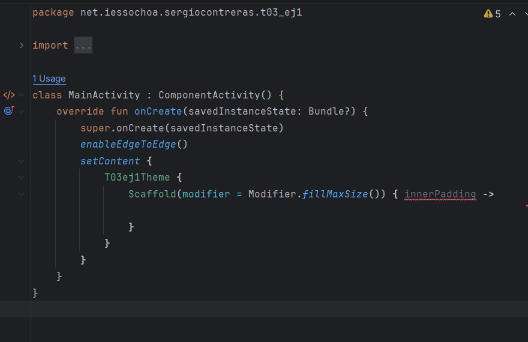

Creamos nuestro Composable `HelloWorldComposable` y su *preview* `HelloWorldComposablePreview`, que nos permite ver el Composable sin compilar la app entera. Añadir `Preview` al nombre del Composable es una convención que nos permite identificarlo fácilmente.

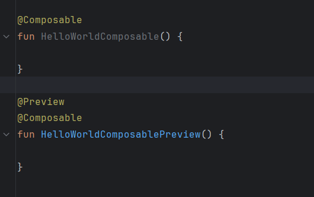

Actualizamos la firma: no queremos *hardcodear* el texto, sino que se le pueda pasar como parámetro. Por eso añadimos un parámetro `text` de tipo `String`.

Fíjate también en el parámetro opcional `modifier` de tipo `Modifier`. El `Modifier` es un objeto que nos permite aumentar o decorar un Composable: añadirle un *padding*, un borde, un fondo, una sombra, etc. Se pasa como parámetro y se pueden encadenar varias modificaciones. Es (aproximadamente) como el `css` de la web, pero en Kotlin.

Es **el patrón estándar de Compose**: todo Composable reutilizable acepta un `modifier: Modifier = Modifier` como **primer parámetro opcional** y se lo pasa a su primer hijo. Así quien lo usa puede decidir márgenes, tamaño, alineación… desde fuera, sin tocar su código. Lo verás en todos los ejercicios del curso.

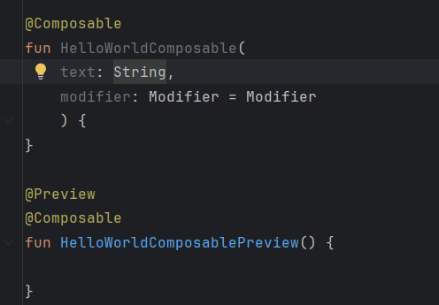

Nuestro Composable es básicamente un *wrapper* de un `Text`, el Composable que pinta texto en la pantalla. Lo normal es que un Composable propio anide varios, pero en este punto tan introductorio nos quedamos solo con el `Text`, aunque no tenga excesivo sentido.

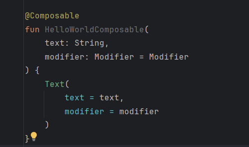

Fíjate en cómo pasamos el `modifier` que nos llega como parámetro al `Text`.

Hora de montar la *preview*. Primero le pasamos a la anotación `@Preview` los parámetros `showBackground = true`, para que muestre un fondo, y `showSystemUi = true`, para que muestre la barra de estado y la barra de navegación. Así vemos el Composable tal y como se verá en el móvil.

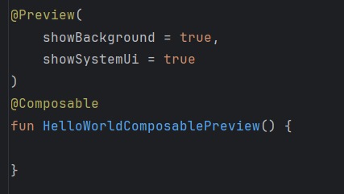

Replicamos dentro la estructura con el `Theme` y el `Scaffold` que teníamos en `MainActivity`. Así vemos el Composable dentro del contexto de la app, con su tema y su estructura básica.

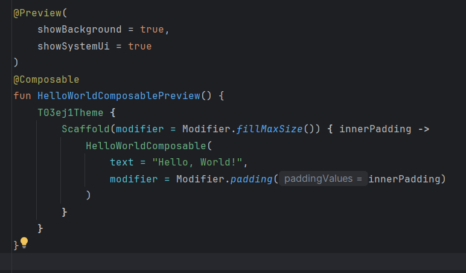

En modo *Split* ya podemos ver el resultado en la *preview*, con el texto que le hemos pasado como parámetro.

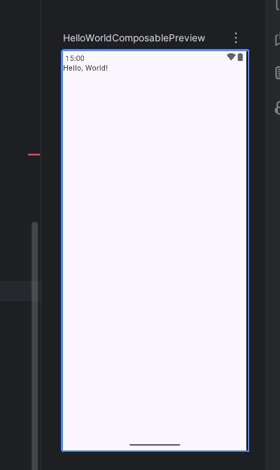

La *preview* es muy útil para ir viendo los cambios que hacemos en el Composable en tiempo real: el emulador de Android es muy pesado y tarda mucho en arrancar.

Por último, montamos esto mismo en `MainActivity` para que se vea en el emulador o en el móvil: dentro del `setContent` llamamos a `HelloWorldComposable` y le pasamos el texto que queremos mostrar.

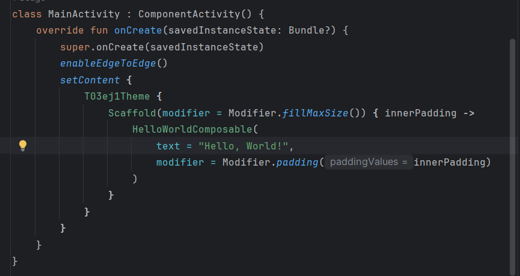

### Cambiar el color de fondo con `Surface`

Para cambiar el color de fondo usaremos el Composable `Surface`, un contenedor canónico para modificar borde, color de fondo, etc.

Para envolver nuestro Composable con él: selecciónalo, pulsa `Alt + Enter` -> **Surround with widget** -> **Surround with Container** y cambia el `Box` que genera por `Surface`.

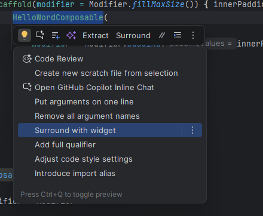

Al meter el `Surface`, que será el contenedor visual, tenemos que mover a él el `modifier` que antes le pasábamos a nuestro Composable, para que el *padding* se aplique al contenedor. Si no, el *padding* se aplicaría solo al texto (o dos veces, si lo dejamos en ambos sitios) y el resultado visual sería diferente.

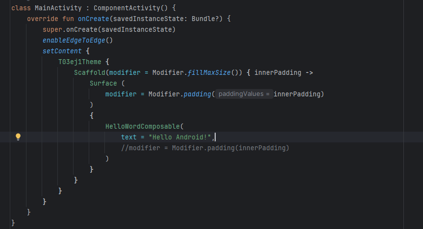

`Surface` tiene un parámetro `color` para cambiar el color de fondo:

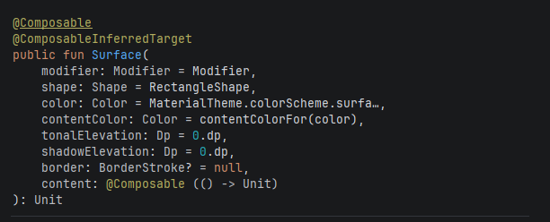

Para indicar el color usamos la clase `Color`, que permite definir colores en diferentes formatos (RGB, ARGB, etc.). Al escribir `Color` verás que el IDE nos sugiere bastantes opciones para autoimportar. Habitualmente la buena es la primera, pero no siempre: esto requiere un poco de experiencia, atención o consultar la documentación. En este caso nos interesa `androidx.compose.ui.graphics.Color` (¡no `android.graphics.Color`!). Si no se ha importado, `Alt + Enter` lo importa automáticamente.

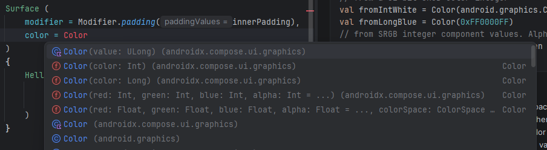

Borramos los paréntesis que nos habrá autocompletado, ponemos el punto y escribimos `Cyan`; el autocompletado sugiere los colores al escribir el punto tras `Color`. El resultado final es `color = Color.Cyan`.

Es buen momento para usar **Optimize Imports** (`Ctrl + Alt + O`) y mantener los imports ordenados y sin restos. Equivale a desplegar la lista de imports y borrar a mano los que no se usan (los que aparecen en gris).

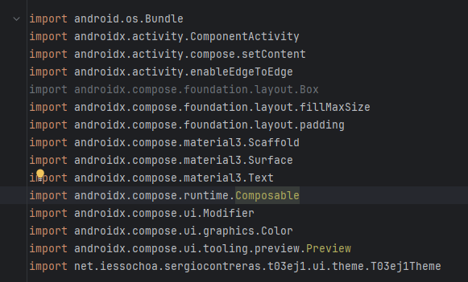

> [!WARNING]
> **Lo que pongas en la *preview* no aparece en la app, y al revés.** Prueba ahora a comparar: la *preview* sigue mostrando el texto sin fondo, pero si lanzas la app en el emulador sí verás el fondo cyan. La *preview* muestra la función que tiene la anotación `@Preview`, y el emulador lo que lance `onCreate()` en `MainActivity`; como el `Surface` solo lo hemos puesto en `MainActivity`, no coinciden. Es el error típico número 1: "he cambiado el texto y en el móvil no sale".

### Añadir un `padding`

Un *padding* es un espacio entre el contenido de un Composable y su borde. Nos permite separar visualmente el contenido y mejorar la legibilidad y la estética de la interfaz.

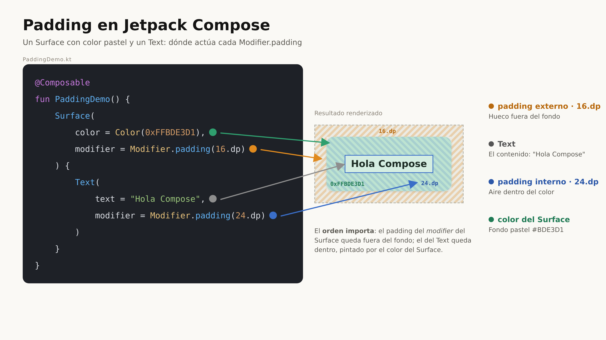

Como ves en el diagrama, **dónde** pongas el *padding* importa: en el `modifier` del `Surface` queda fuera del fondo, y en el del `Text` queda dentro, pintado con el color del `Surface`.

Para aplicarlo usamos `Modifier.padding(24.dp)`, donde `dp` son píxeles independientes de la densidad (*density-independent pixels*), lo que permite que el *padding* se vea igual en pantallas con diferente resolución. Necesitarás dos imports nuevos: `padding` y `dp`.

Para terminar, mueve el `Surface` **dentro** de tu Composable. Es un lugar mejor para ponerlo y así la *preview* y `MainActivity` mostrarán lo mismo:

```kotlin
@Composable
fun HelloWorldComposable(
    text: String,
    modifier: Modifier = Modifier
) {
    Surface(
        color = Color.Cyan,
        modifier = modifier
    ) {
        Text(
            text = text,
            modifier = Modifier.padding(24.dp)
        )
    }
}
```

Siéntete libre de experimentar con otros colores y textos: cambia el fondo a `Color.Yellow` o `Color.Green`, usa el código hexadecimal de un color (`Color(0xFFBDE3D1)`; ojo, aquí el canal alfa va **delante**, no detrás) o cambia el texto a "Hola, soy *tu nombre*". Así verás cómo afecta cada cambio al resultado final.

Si sigues el *codelab* en lugar de esta guía, este es su resultado final, con el nombre "Meghan" y fondo cyan:


### Ejecutar en el emulador

Para lanzar la app necesitas un dispositivo virtual (AVD). Para crearlo, puedes seguir los pasos de este vídeo: [Crear un emulador en Android Studio de forma correcta y rápida](https://www.youtube.com/watch?v=lhTbyjzujAE).

Con el emulador creado, pulsa el botón ▶️ de la barra superior y comprueba que la app arranca. ¡No confundas el emulador con la *preview* de Compose!

Como práctica **opcional**, ejecútala también en tu móvil siguiendo el apartado siguiente.

-----

## Ejecutar en un dispositivo físico

Si no tenéis un ordenador muy potente, el emulador de Android es una de las partes que más recursos consumen. Una opción más ligera puede ser ejecutar la app en vuestro teléfono móvil, por cable USB o por Wi‑Fi.

La referencia oficial es el *codelab* [Connect your Android device](https://developer.android.com/codelabs/basic-android-kotlin-compose-connect-device#0) y, para las últimas versiones de Android Studio, la [documentación oficial](https://developer.android.com/studio/run).

La conexión se hace con **ADB** (Android Debug Bridge), una herramienta de línea de comandos que permite la comunicación con un dispositivo Android y que viene con Android Studio y el SDK. Si conectas el móvil por USB el proceso es transparente, al menos en Windows.

### Activar las opciones de desarrollador 📲

Esto cambia de móvil a móvil; los nombres de ejemplo son los de MIUI (Xiaomi).

1. **Activa las Opciones de desarrollador**: ve a *Ajustes -> Sobre el teléfono* y pulsa unas 7 veces sobre *Versión de MIUI*, *Versión del sistema operativo* o *Número de compilación* (depende del fabricante) hasta que aparezca el mensaje "¡Ahora eres desarrollador!".
2. Vuelve atrás y entra en **Ajustes adicionales -> Opciones de desarrollador**.
3. Activa:
   - **Depuración USB** (sí, aunque vayas a conectar por Wi‑Fi, es requisito previo).
   - **Depuración inalámbrica** (*Wireless debugging*), si quieres conectar por Wi‑Fi.
4. Dentro de **Depuración inalámbrica**, elige **Emparejar dispositivo con código de emparejamiento** o **Emparejar dispositivo con código QR** (Android Studio muestra el QR).

Para la conexión por Wi‑Fi, asegúrate de que **PC y móvil están en la misma red**.

### Conectar desde Android Studio 💻

1. Conecta el móvil por USB **solo la primera vez** para que ADB lo reconozca. Sabrás que lo ha reconocido porque, a los pocos segundos, aparecerá el nombre del dispositivo en la barra superior de Android Studio. Asegúrate de que usas un **cable de datos** y no solo de carga.

   

2. Abre **Device Manager** -> pestaña **Pair using Wi‑Fi**.
3. Elige emparejar por **QR** o por **código**. Si usas código, en el móvil selecciona *Emparejar con código* dentro de *Depuración inalámbrica* e introduce en Android Studio el código que aparece en el teléfono.
4. Una vez emparejado, Android Studio mostrará tu dispositivo como disponible vía Wi‑Fi.
5. Puedes desconectar el cable y ejecutar la app directamente.

-----

## Ejercicio 2 (práctica guiada): textos, filas y columnas

*Práctica guiada, no se entrega.*

Basado en el *codelab* oficial [Compila una app simple con elementos de texto componibles](https://developer.android.com/codelabs/basic-android-kotlin-compose-text-composables). Aquí va lo esencial, reordenado y sin rodeos.

**Objetivo:** construir una tarjeta de felicitación ("Happy Birthday") que muestre un mensaje grande y una firma. En vez de Sam y Emma, como en el *codelab*, haz que aparezcan tu nombre y el de María. Feliz cumpleaños o *happy birthday*, cualquiera vale.

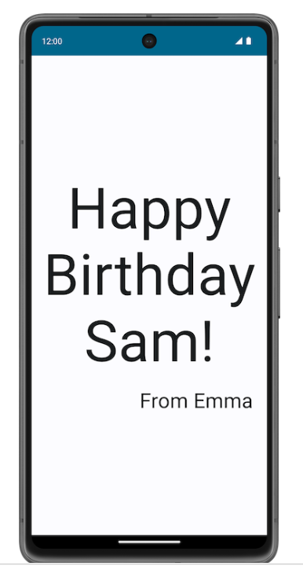

Crea un proyecto nuevo con la plantilla *Empty Activity*, llámalo `T03-ej2` (paquete `net.iessochoa.tunombre.t03_ej2`) y deja el *Minimum SDK* en API 26, como en el ejercicio anterior.

> [!TIP]
> Aquí se usan sin parar cosas de Kotlin que ya conocéis de T02: **parámetros con valor por defecto**, **argumentos con nombre** y **string templates** (`$name`).

### Anotaciones: `@Composable` y `@Preview`

Una anotación es metainformación que se pega al código con `@`. Puede llevar parámetros.

| Anotación | Para qué sirve |
|---|---|
| `@Composable` | "Esta función genera UI". Obligatoria en todo Composable. |
| `@Preview` | "Pinta esta función en el panel *Design* de Android Studio". |
| `@Preview(showBackground = true)` | Igual, pero con fondo blanco. |
| `@Preview(showBackground = true, showSystemUi = true)` | Muestra además el marco del móvil (barra de estado, etc.). |

Una función con `@Preview` **no puede tener parámetros obligatorios** (¿de dónde sacaría Android Studio el valor?). Por eso el patrón es una función "de verdad" con parámetros y una *preview* sin ellos que la llama con datos de ejemplo:

```kotlin
@Composable
fun GreetingText(message: String, from: String) { ... }   // la de verdad

@Preview(showBackground = true)
@Composable
fun BirthdayCardPreview() {                                // solo para mirar
    T03ej2Theme {
        GreetingText(message = "Happy Birthday Maria!", from = "From Sergio")
    }
}
```

### Cómo se llaman los Composables

Convención oficial: **PascalCase y sustantivo** (es un *elemento* de la UI, no una acción).

| ✅ Bien | ❌ Mal | Por qué está mal |
|---|---|---|
| `FancyButton()` | `fancyButton()` | No es PascalCase |
| `RoundIcon()` | `RenderFancyButton()` | Es un verbo |
| `BackButtonHandler()` | `drawProfileImage()` | Ni PascalCase ni sustantivo |

Fijaos en que esto rompe la convención habitual de Kotlin (funciones en camelCase). Es a propósito: así se distingue a simple vista qué funciones son UI.

### Un texto grande: `sp` y `dp`

Borrad la función `Greeting` y sus llamadas (en `onCreate` y en la *preview*) y renombrad la *preview* a `BirthdayCardPreview`. Después creamos `GreetingText` siguiendo el patrón del `modifier` que vimos en el Ejercicio 1:

```kotlin
@Composable
fun GreetingText(message: String, modifier: Modifier = Modifier) {
    Text(
        text = message,
        fontSize = 100.sp,
        lineHeight = 116.sp,
        modifier = modifier
    )
}
```

- **`sp`** (*scale-independent pixels*): unidad para **texto**. Se escala con el tamaño de fuente que el usuario elige en los ajustes del móvil (accesibilidad).
- **`dp`** (*density-independent pixels*): unidad para **todo lo demás** (márgenes, tamaños, *padding*).
- `100.sp` es una *propiedad de extensión* sobre `Int` (también funciona con `Float` y `Double`). Necesita `import androidx.compose.ui.unit.sp` -> `Alt + Enter` sobre lo rojo.
- Si la letra es enorme y las líneas se pisan, falta `lineHeight`.

Ahora añadimos el segundo texto, la firma:

```kotlin
@Composable
fun GreetingText(message: String, from: String, modifier: Modifier = Modifier) {
    Text(text = message, fontSize = 100.sp, lineHeight = 116.sp, modifier = modifier)
    Text(text = from, fontSize = 36.sp)
}
```

Resultado: **los dos textos salen uno encima del otro, superpuestos.** Compose no sabe cómo colocarlos porque no se lo hemos dicho. Esto lleva a lo más importante de la práctica 👇

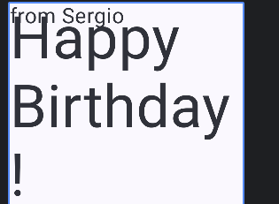

### Layouts: `Row`, `Column` y `Box`

A continuación teneis una infografía que explica los contenedores que se utilizan para organizar el layout de sus Composables hijos. `Row` organiza a sus hijos en horizontal, `Column` en vertical y `Box` los apila unos encima de otros.

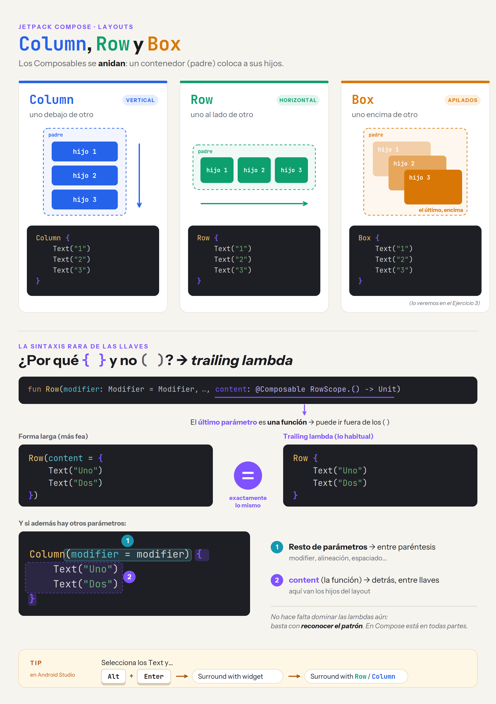

#### Aplicado a la tarjeta

Con `Row` el mensaje y la firma ya no se pisan, pero la firma se queda sin sitio. Lo que queremos es `Column`, y el `modifier` pasa del `Text` a la `Column`, que ahora es el primer hijo:

```kotlin
@Composable
fun GreetingText(message: String, from: String, modifier: Modifier = Modifier) {
    Column(modifier = modifier) {
        Text(text = message, fontSize = 100.sp, lineHeight = 116.sp)
        Text(text = from, fontSize = 36.sp)
    }
}
```

### Llevarlo a la app y alinear

Desde `onCreate`, dentro del `Scaffold`, llamamos a `GreetingText` pasándole el `innerPadding` (en el *codelab* aparece un `Surface` porque usa la plantilla antigua; es el paso que allí llaman **Adopt good practice**):

```kotlin
T03ej2Theme {
    Scaffold(modifier = Modifier.fillMaxSize()) { innerPadding ->
        GreetingText(
            message = "Happy Birthday Maria!",
            from = "From Sergio",
            modifier = Modifier.padding(innerPadding)
        )
    }
}
```

Ejecutad en el emulador. **Ahora sí** se ve en la app. Recordad la diferencia entre lo que aparece en la *preview* y lo que se muestra en el emulador:


No coinciden porque la *preview* y `onCreate` montan cosas distintas: una llama a `GreetingText` a pelo y la otra lo mete en un `Scaffold`. La solución es tener **un único Composable raíz** con el tema y el `Scaffold`, y llamarlo desde los dos sitios:

```kotlin
@Composable
fun BirthdayApp() {
    T03ej2Theme {
        Scaffold(modifier = Modifier.fillMaxSize()) { innerPadding ->
            GreetingText(
                message = "Happy Birthday Maria!",
                from = "From Sergio",
                modifier = Modifier.padding(innerPadding)
            )
        }
    }
}

@Preview(showBackground = true, showSystemUi = true)
@Composable
fun BirthdayCardPreview() {
    BirthdayApp()
}
```

Y en `MainActivity` el `setContent` se queda en una línea:

```kotlin
setContent {
    BirthdayApp()
}
```

Ahora la *preview* y el emulador pintan exactamente lo mismo: si cambias algo en `BirthdayApp`, lo ves en los dos sitios. Acostumbraos a este patrón (`XxxApp()` llamado desde `setContent` y desde la *preview*), porque lo vamos a repetir en todos los proyectos. 

>[!NOTE]
> El `showSystemUi` tiene un defecto y es que aplica su `innerPadding` con un valor de 0, así que la *preview* no refleja exactamente lo que se ve en el emulador. En este punto hay dos opciones, quitar el `showSystemUi` de la *preview* o dejarlo, hacer que `BirthdayApp()` pueda recibir un parámetro `modifier` opcional y pasarle un `padding(top = 24.dp)` desde la *preview*. Aquí a gusto del consumidor, pero lo importante es que la *preview* y el emulador pinten lo mismo.

Ahora toca centrar y alinear. Para la alineación del texto dentro de su propio bloque usamos `textAlign = TextAlign.Center`. Para centrar el bloque en la pantalla usamos `verticalArrangement = Arrangement.Center` en la `Column`. Y para alinear la firma a la derecha usamos `Modifier.align(Alignment.End)` en el segundo `Text`.

```kotlin
@Composable
fun GreetingText(message: String, from: String, modifier: Modifier = Modifier) {
    Column(
        verticalArrangement = Arrangement.Center,   // centra el bloque en vertical
        modifier = modifier
    ) {
        Text(
            text = message,
            fontSize = 100.sp,
            lineHeight = 116.sp,
            textAlign = TextAlign.Center            // centra el texto dentro de sí mismo
        )
        Text(
            text = from,
            fontSize = 36.sp,
            modifier = Modifier
                .padding(16.dp)
                .align(alignment = Alignment.End)   // este hijo, a la derecha
        )
    }
}
```

Si lo ejecutáis así, **el bloque no se centra**. `verticalArrangement` reparte los hijos dentro del espacio que ocupa la `Column`, y la `Column` solo mide lo que miden sus dos textos, así que no hay sitio sobrante que repartir. El `fillMaxSize()` del `Scaffold` no se hereda: el `Scaffold` deja que su contenido mida lo que necesite.

Para que el bloque quede centrado en toda la pantalla, la `Column` tiene que ocuparla entera. Se lo pedimos desde la llamada en `BirthdayApp`:

```kotlin
GreetingText(
    message = "Happy Birthday Maria!",
    from = "From Sergio",
    modifier = Modifier
        .fillMaxSize()
        .padding(innerPadding)
)
```

> [!NOTE]
> En el *codelab* esto no hace falta porque usa la plantilla antigua, con un `Surface(modifier = Modifier.fillMaxSize())`. El `Surface` obliga a su hijo a ocupar todo su tamaño; el `Scaffold` de la plantilla nueva no.

Tres formas distintas de "alinear", que conviene no confundir:

| Qué | Dónde se pone | Afecta a |
|---|---|---|
| `verticalArrangement` | parámetro de `Column` | cómo se reparten **todos** los hijos en el eje principal |
| `textAlign` | parámetro de `Text` | cómo se alinean las letras **dentro** de ese texto |
| `Modifier.align(...)` | modifier de **un hijo** | dónde se coloca **ese** hijo dentro de la columna |

Buenas prácticas que aparecen de paso:

- *Padding* en múltiplos de **4.dp** (8, 16, 24…).
- Los modifiers se **encadenan** con `.` (`.padding(16.dp).align(...)`), y el orden importa (lo veremos en el Ejercicio 3). A mi me gusta separarlo en varias líneas para que se vea mejor.
- El *padding* "externo" de un componente mejor pasarlo desde el padre (en la llamada), no fijarlo dentro.


### Errores típicos

Algunas cuestiones qe os podéis encontrar durante la reaalización de esta práctica.

1. **"He cambiado el texto y en el móvil no sale"** -> lo cambiaste en la *preview*, no en `onCreate`.
2. **La *preview* no aparece** -> la función `@Preview` tiene parámetros sin valor por defecto, o falta `@Composable`.
3. **`.sp` / `.dp` / `Column` en rojo** -> falta el import. `Alt + Enter`.
4. **Textos superpuestos** -> varios Composables sin contenedor. Metedlos en `Column`/`Row`.
5. **Letras gigantes que se pisan** -> falta `lineHeight`.
6. **El texto queda debajo de la barra de estado** -> no estás usando el `innerPadding` del `Scaffold`.

### Resumen

- La UI en Compose = funciones `@Composable` que no devuelven nada.
- `@Preview` sirve para ver la UI en el IDE; no afecta a la app.
- Nombres de Composables: PascalCase y sustantivo.
- Texto en `sp`, todo lo demás en `dp`.
- `Column` (vertical), `Row` (horizontal), `Box` (apilado) organizan a los hijos.
- Patrón obligatorio: `modifier: Modifier = Modifier` como parámetro y pasado al primer hijo.

### Mini-retos (opcionales)

1. Añade un tercer `Text` con la fecha, entre el mensaje y la firma, a tamaño `24.sp`.
2. Cambia la `Column` por una `Row` y explica en una frase qué pasa y por qué.
3. Crea una segunda *preview* con `showSystemUi = true` y el mensaje en otro idioma.
4. Haz que la firma quede **centrada** en vez de a la derecha (pista: `Alignment.CenterHorizontally`).
5. Extrae la firma a su propio Composable `Signature(from: String, modifier: Modifier = Modifier)` respetando el patrón del modifier, y úsalo dentro de `GreetingText`.

-----

## Ejercicio 3 (práctica guiada): imágenes, `Box` y recursos

*Práctica guiada, no se entrega.*

Basado en el *codelab* oficial [Agrega imágenes a tu app para Android](https://developer.android.com/codelabs/basic-android-kotlin-compose-add-images). Continúa la tarjeta del Ejercicio 2.

**Objetivo:** poner una foto de fondo a pantalla completa detrás de la tarjeta de felicitación y, de paso, aprender a trabajar bien con **recursos** (imágenes y textos) en lugar de meterlo todo en el código.

Crea un nuevo proyecto llamado `T03-ej3` (paquete `net.iessochoa.tunombre.t03_ej3`) y copia en él el código del Ejercicio 2. Asegúrate de reemplazar los literales que contengan `t03_ej2` -> `t03_ej3` y `T03ej2` -> `T03ej3` (deberían ser unos 5 reemplazos).


### Qué es un recurso

Un **recurso** es cualquier contenido estático que usa la app y que **no es código**: imágenes, textos, colores, iconos, animaciones… Viven en la carpeta `res/`, cada tipo en su subcarpeta:

```text
app/src/main/
├── java/.../MainActivity.kt      ← código
└── res/                          ← recursos
    ├── drawable/                 ← imágenes y gráficos
    ├── drawable-nodpi/           ← imágenes que Android NO debe reescalar
    ├── mipmap/                   ← icono de la app (launcher)
    └── values/
        └── strings.xml           ← textos
```

¿Por qué separarlos del código?

- **Traducción:** Android elige solo `values-es/strings.xml` o `values-en/strings.xml` según el idioma del móvil.
- **Adaptación al dispositivo:** puede elegir una imagen u otra según la densidad de pantalla, la orientación, el modo oscuro…
- **Mantenimiento:** cambias un texto en un sitio y se actualiza en toda la app.

#### La clase `R`

Android genera automáticamente una clase `R` con un **ID numérico para cada recurso**. El ID se llama igual que el fichero (sin extensión):

| Fichero | Cómo se referencia en código |
|---|---|
| `res/drawable/androidparty.png` | `R.drawable.androidparty` |
| `<string name="signature_text">` en `strings.xml` | `R.string.signature_text` |

> [!WARNING]
> Los nombres de recursos van **en minúsculas y con guiones bajos** (`happy_birthday_text`). Nada de mayúsculas, espacios ni guiones medios: si no, `R` no compila.

### Añadir la imagen al proyecto

1. Descargad la imagen del *codelab* y guardadla como `androidparty.png`. Enlace: [https://github.com/google-developer-training/basic-android-kotlin-compose-birthday-card-app/blob/main/app/src/main/res/drawable-nodpi/androidparty.png](https://github.com/google-developer-training/basic-android-kotlin-compose-birthday-card-app/blob/main/app/src/main/res/drawable-nodpi/androidparty.png)
2. En Android Studio: **View -> Tool Windows -> Resource Manager** (o la pestaña que hay junto a *Project*).

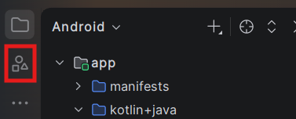

3. **+ -> Import Drawables** -> elegid el fichero.

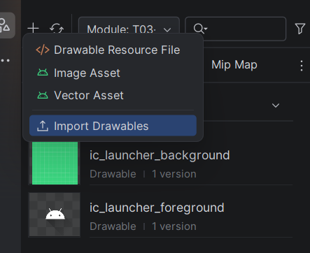

4. En **Qualifier type** elegid **Density** y en **Value** elegid **No Density** -> *Next* -> *Import*.

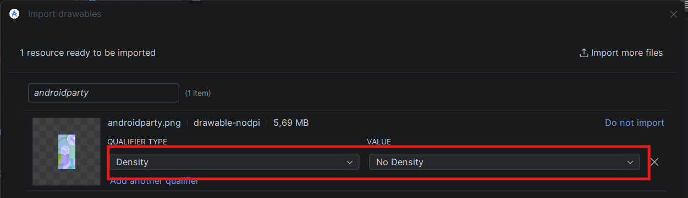

5. Comprobad en *Project* que aparece en `res/drawable` como `androidparty.png (nodpi)`.

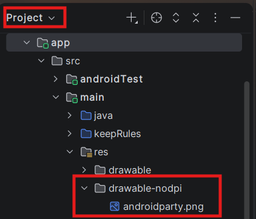

¿Por qué *No Density*? Hay móviles con ~160 píxeles por pulgada y otros con ~480. Si no le dices nada, Android **reescala** las imágenes para adaptarlas a cada densidad, y con una foto grande eso puede dar imágenes borrosas, mucho consumo de memoria o directamente un `OutOfMemoryError`. Las **fotos y fondos** van en `drawable-nodpi` para que Android las deje tal cual.

> [!TIP]
> Regla rápida: iconos y gráficos pequeños -> `drawable` (o mejor, vectoriales). Fotos grandes de fondo -> `drawable-nodpi`.

### El Composable `Image`

Vamos a crear un nuevo fichero `GreetingImage.kt` y escribir en este el Composable que se encarga de pintar el fondo de la tarjeta. Aprovechamos de paso y lo creamos sobre el *package* de `ui` y no en `ui.theme`, que es solo para el tema. Para esto hay que hacer un poco de truco, crearlo primero en `ui.theme` y luego moverlo a `ui` con *Refactor -> Move*.


Vamos ahora al ajo. Igual que `Text` pinta texto, `Image` pinta imágenes. Se hace en dos pasos:

```kotlin
@Composable
fun GreetingImage(message: String, from: String, modifier: Modifier = Modifier) {
    val image = painterResource(R.drawable.androidparty)   // 1. cargar el recurso
    Image(
        painter = image,                                    // 2. pintarlo
        contentDescription = null
    )
}
```

- `painterResource(id)` carga el drawable y devuelve un `Painter` (el objeto que sabe dibujarlo).
- Imports que pedirá Android Studio (`Alt + Enter`): `androidx.compose.ui.res.painterResource` y `androidx.compose.foundation.Image`.

El import de `R` tiene un poco de truco, porque es un nombre que se utiliza mucho en Android. Aseguraos de que el que se importa es el **del paquete de vuestra app**, no otro. Si no, `R.drawable.androidparty` sale en rojo.

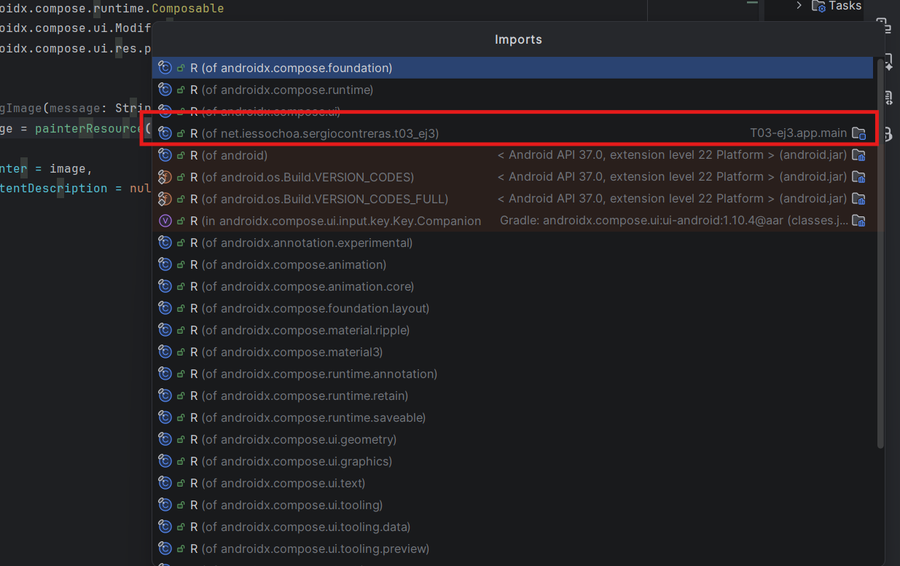

#### `contentDescription` es obligatorio (aunque sea `null`)

Es el texto que lee **TalkBack** (el lector de pantalla de Android) a personas con discapacidad visual. Si no lo ponéis, verás el error *"None of the following functions can be called with the arguments provided"*: no es opcional, aunque puede ser `null` si la imagen es puramente decorativa. En este caso, como es un fondo, lo ponemos a `null`:

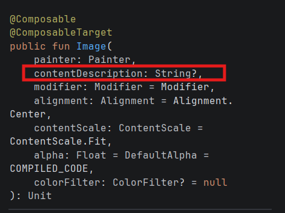

| Tipo de imagen | `contentDescription` |
|---|---|
| Aporta información (foto de producto, icono de "borrar"…) | Una descripción útil: `"Borrar mensaje"` (y mejor como recurso de string) |
| **Puramente decorativa** (como nuestro fondo) | `null` -> TalkBack la ignora |

Poner una descripción a algo decorativo **empeora** la accesibilidad: obliga al usuario a escuchar ruido.

### `Box`: apilar elementos

En el Ejercicio 2 vimos `Column` y `Row`. Ahora toca el tercero:

En un `Box` **el orden importa**: el primer hijo queda al fondo y cada uno de los siguientes se pinta encima del anterior. Es lo que necesitamos para poner texto sobre una foto.

> [!TIP]
> Box es una caja donde lanzas los Composables de arriba a abajo, el último que tiras queda por tanto encima, como ocurriría en una caja.

```kotlin
@Composable
fun GreetingImage(message: String, from: String, modifier: Modifier = Modifier) {
    val image = painterResource(R.drawable.androidparty)
    Box(modifier) {                       // patrón: el modifier va al primer hijo
        Image(
            painter = image,
            contentDescription = null
        )
        GreetingText(                     // reutilizamos lo del Ejercicio 2
            message = message,
            from = from,
            modifier = Modifier
                .fillMaxSize()
                .padding(8.dp)
        )
    }
}
```

Fijaos en la **composición**: `GreetingImage` no repite el código de los textos, llama a `GreetingText`. Los Composables se construyen unos con otros, como piezas de Lego.

Después, cambiad la *preview* y `onCreate` para que llamen a `GreetingImage` en lugar de `GreetingText`.

> [!NOTE]
> **Con la plantilla actual (`Scaffold` + *edge-to-edge*):** si le pasáis `Modifier.padding(innerPadding)` a `GreetingImage`, la foto no llegará a ocupar la zona de la barra de estado. Para un fondo a pantalla completa queda mejor que la imagen ocupe todo y aplicar el `innerPadding` solo al texto. Para este ejercicio, cualquiera de las dos opciones vale.

### Ajustar la imagen: `contentScale` y `alpha`

Al principio la foto sale arriba del todo y deja un hueco blanco debajo. Lo arreglamos con:

```kotlin
Image(
    painter = image,
    contentDescription = null,
    contentScale = ContentScale.Crop,   // rellena todo el espacio, recortando lo que sobre
    alpha = 0.5F                        // 50 % de opacidad -> el texto se lee mejor
)
```

Los `ContentScale` más útiles:

| Valor | Qué hace | Cuándo usarlo |
|---|---|---|
| `Fit` (por defecto) | Cabe entera, mantiene la proporción, puede dejar huecos | Logos, imágenes que no se pueden cortar |
| `Crop` | Rellena todo manteniendo la proporción, recorta lo que sobra | **Fondos**, fotos de portada |
| `FillBounds` | Rellena todo **deformando** la imagen | Casi nunca (se ve estirada) |
| `Inside` | Como `Fit`, pero nunca la agranda | Imágenes pequeñas que no queréis pixelar |

`alpha` va de `0F` (invisible) a `1F` (opaca). La `F` indica que el número es un `Float` (lo vimos en T02). También puede ser una `f` (minúscula).

### Modifiers más a fondo

Ya sabéis que un **Modifier** decora o cambia el comportamiento de un Composable (tamaño, márgenes, fondo, clics…) y que se **encadenan** con `.`. Lo importante ahora es que **se aplican en orden**, igual que veíamos con el *padding* del `Surface` en el Ejercicio 1:

```kotlin
Modifier
    .padding(16.dp)
    .background(Color.Green)   // margen fuera, el verde solo detrás del texto 
Modifier.background(Color.Green).padding(16.dp)   // el verde incluye también el relleno
```

Probad las dos en la *preview*: es la forma más rápida de entenderlo.

#### Padding por lados

```kotlin
Modifier.padding(16.dp)                                   // los cuatro lados
Modifier.padding(horizontal = 16.dp, vertical = 8.dp)
Modifier.padding(start = 16.dp, top = 16.dp, end = 16.dp, bottom = 16.dp)
```

Se usa `start`/`end` y no `left`/`right` porque en idiomas que se escriben de derecha a izquierda (árabe, hebreo) se invierte solo.

#### Arrangement y Alignment: eje principal y eje secundario

Esto es lo que más se lía, y es parecido al flexbox de CSS, así que en una tabla:

| | Eje **principal** -> `Arrangement` | Eje **secundario** -> `Alignment` |
|---|---|---|
| `Column` | `verticalArrangement` (arriba/abajo) | `horizontalAlignment` (izquierda/derecha) |
| `Row` | `horizontalArrangement` (izquierda/derecha) | `verticalAlignment` (arriba/abajo) |

- **Arrangement** = cómo se **reparten** los hijos en la dirección en la que se apilan. Solo tiene efecto si sobra espacio. Valores: `Top`/`Start`, `Center`, `Bottom`/`End`, `SpaceBetween`, `SpaceAround`, `SpaceEvenly`.
- **Alignment** = dónde se colocan los hijos en el **otro** eje: `Start`, `CenterHorizontally`, `End` (en `Column`), y `Top`, `CenterVertically`, `Bottom` (en `Row`).
- **`Modifier.align(...)`** sobre un hijo concreto **sobrescribe** el alignment del padre solo para ese hijo.

### Strings como recurso

Un texto escrito directamente en el código (*hardcoded*) no se puede traducir y hay que cambiarlo a mano en cada sitio donde aparece. Para extraerlo:

1. Seleccionad `Happy Birthday Maria!` (sin comillas) en `BirthdayApp`.
2. `Alt + Enter` -> **Extract string resource**.

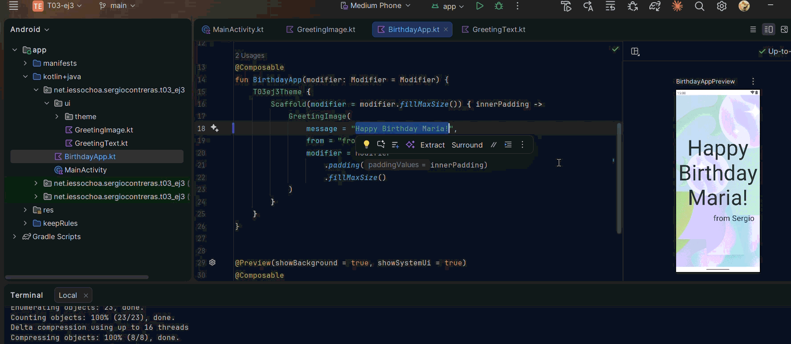

3. *Resource name*: `happy_birthday_text` -> OK.
4. Repetid con la firma -> `signature_text`.

Resultado en `res/values/strings.xml`:

```xml
<resources>
    <string name="app_name">T03-ej3</string>
    <string name="happy_birthday_text">Happy Birthday Maria!</string>
    <string name="signature_text">From Sergio</string>
</resources>
```

Y en el código:

```kotlin
GreetingImage(
    message = stringResource(R.string.happy_birthday_text),
    from = stringResource(R.string.signature_text)
)
```

Fijaos en que hasta el nombre de la app (`app_name`) es un recurso de string.

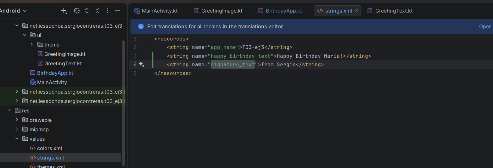

#### `getString()` vs `stringResource()`

A veces Android Studio genera `getString(R.string...)` al extraer. **Cambiadlo a `stringResource()`** (import: `androidx.compose.ui.res.stringResource`):

- `getString()` es un método de la `Activity`: funciona en `onCreate`, pero **no** dentro de un Composable cualquiera (ni en la *preview*).
- `stringResource()` es la versión Compose: funciona en cualquier `@Composable` y se actualiza si cambia la configuración (por ejemplo, el idioma).

### Errores típicos

1. **`Unresolved reference: androidparty`** -> la imagen no se importó, se llama distinto o el nombre tiene mayúsculas/guiones.
2. **"None of the following functions can be called…" en `Image`** -> falta `contentDescription`.
3. **La imagen deja un hueco blanco** -> falta `contentScale = ContentScale.Crop`.
4. **El texto queda *debajo* de la imagen y no se ve** -> en el `Box` habéis puesto el texto antes que la imagen. El orden importa.
5. **`getString` en rojo dentro de la *preview*** -> usad `stringResource`.
6. **Texto ilegible sobre la foto** -> bajad el `alpha` de la imagen.

### Resumen

- Los recursos (imágenes, textos…) van en `res/` y se referencian con `R.tipo.nombre`.
- Fotos grandes -> `drawable-nodpi`, para que Android no las reescale.
- `Image(painter = painterResource(...), contentDescription = ...)`; `null` si es decorativa.
- `Box` apila hijos: el primero al fondo.
- `contentScale` controla cómo se ajusta la imagen; `alpha`, su opacidad.
- Nada de textos a fuego: `strings.xml` + `stringResource()`.

### Mini-retos (opcionales)

1. **(El reto del *codelab*)** Centra horizontalmente la firma con `Modifier.align(Alignment.CenterHorizontally)`.
2. Cambia `ContentScale.Crop` por `Fit` y por `FillBounds`, y describe en una frase qué pasa con cada uno.
3. **Traduce la app:** crea `res/values-es/strings.xml` con `¡Feliz cumpleaños, María!` y `De Sergio`, cambia el idioma del emulador a español y comprueba que cambia sola. (Pista: en el editor de `strings.xml` está el **Translations Editor**.)
4. Añade una segunda *preview* con `@Preview(locale = "es")` para ver la versión en español sin tocar el emulador.
5. Pon un `Modifier.background(Color.White.copy(alpha = 0.6f))` en la `Column` de los textos y compara con bajar el `alpha` de la imagen. ¿Cuál se lee mejor?
6. Cambia la foto por una tuya (que no sea muy pesada) y ajusta `contentScale` y `alpha` para que quede bien.

### Para ampliar

Sobre `Modifier` y los contenedores `Column`, `Row` y `Box` (la web de Develou ya no existe, así que los enlaces apuntan a la Wayback Machine):

- [Android Layouts en Jetpack Compose](https://web.archive.org/web/2025/https://www.develou.com/android-layouts-en-jetpack-compose/)
- [Compose Modificadores de apariencia](https://web.archive.org/web/2025/https://www.develou.com/compose-modificadores-de-apariencia/)

Es interesante descargar el proyecto con los ejemplos y realizar pruebas:
[https://github.com/jamesreve/android-jetpack-compose.git](https://github.com/jamesreve/android-jetpack-compose.git)

-----

## Ejercicio 4 (práctica libre): practicar Composables

*Práctica libre, no se entrega.*

Crea un nuevo proyecto llamado `T03-ej4` (paquete `net.iessochoa.tunombre.t03_ej4`) con tres ficheros Kotlin (uno para *Compose article*, otro para *Task manager* y el último para *Compose quadrant*) con los Composables que resuelven los problemas del *codelab* [Práctica: Conceptos básicos de Compose](https://developer.android.com/codelabs/basic-android-kotlin-compose-composables-practice-problems). Intenta resolverlos sin consultar la solución.

Puedes crear un nuevo fichero con el botón derecho sobre el paquete: **New -> Kotlin Class/File**.

Como se ha visto en los *codelabs*, estas funciones deben estar parametrizadas para poder reutilizarlas. Por ejemplo, la firma del primer problema podría ser:

```kotlin
@Composable
fun ComposeArticle (
    image: Painter,
    title: String,
    text1: String,
    text2: String,
    modifier: Modifier = Modifier
)
```

-----

## Ejercicio 5 (entregable): tarjeta de presentación 🚨

*Este es el único ejercicio del tema que se entrega.*

> [!WARNING]
> Ve haciendo commits frecuentes, no me hagas un *Zero Shot Commit* al final, si ignoras esta advertencia me reservo el derecho a rechazar la práctica.

Crea un nuevo proyecto llamado `T03-ej5` (paquete `net.iessochoa.tunombre.t03_ej5`) con una pantalla que muestre una tarjeta de presentación como la propuesta en el *codelab* [Proyecto: Crea una app de tarjeta de presentación](https://developer.android.com/codelabs/basic-android-kotlin-compose-business-card).


> [!NOTE]
> Tú tarjeta por favor, no me hagáis todos una copia de la mía que esta es solo un ejemplo.

Para conseguir que la imagen se muestre circular puedes usar el `clip` de `Modifier` ([documentación](https://developer.android.com/develop/ui/compose/graphics/images/customize#clip-image-shape)):

```kotlin
Image(
    painter = foto,
    contentDescription = null,
    contentScale = ContentScale.Crop,
    modifier = Modifier
        .size(150.dp) // Ajusta el tamaño según tus necesidades
        .clip(CircleShape)
)
```

Para los iconos de contacto se usa el Composable `Icon`; cómo conseguirlos lo tienes justo abajo, en [Iconos de contacto](#iconos-de-contacto-icon).

Es aconsejable crear 3 funciones:

1. La función principal de la pantalla, con todos los parámetros.
2. Una función con la parte superior: foto, nombre y trabajo.
3. Una función con los datos de contacto.

### Iconos de contacto: `Icon`

`Icon` se parece mucho a `Image`, pero está pensado para iconos pequeños de un solo color: en lugar de pintar los colores originales, los **tiñe** con `tint` (por defecto, el color de contenido del tema). Así el icono cambia solo si cambias el tema o pasas a modo oscuro.

La pega es de dónde sacar el icono. Si copiáis el código del *codelab*, veréis que `Icons.Default.Phone` sale en rojo: la clase `Icons` vive en una librería aparte que los proyectos nuevos ya no incluyen. Es justo la rotura de `Icon` entre 2025 y 2026 de la que hablábamos al principio del tema. Hay tres caminos.

#### Opción 1 (recomendada): importar el icono como *Vector Asset*

Es lo mismo que hicisteis con la foto en el ejercicio 3, pero con una imagen vectorial:

1. En el **Resource Manager**: **+ -> Vector Asset**. (También vale botón derecho sobre `res` -> **New -> Vector Asset**.)
2. En *Clip art*, pulsad sobre el icono y buscad `phone`. Elegid el que más os guste.
3. Dadle un nombre, por ejemplo `ic_phone` -> *Next* -> *Finish*.
4. Comprobad que aparece `ic_phone.xml` en `res/drawable`.

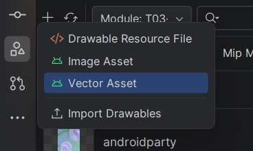

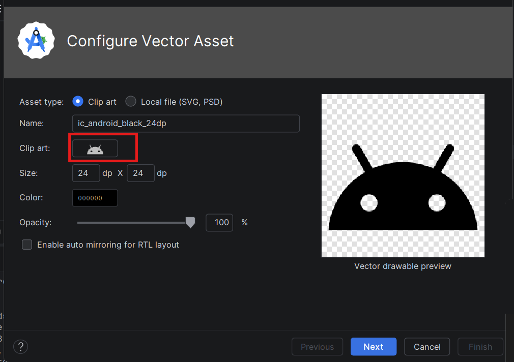

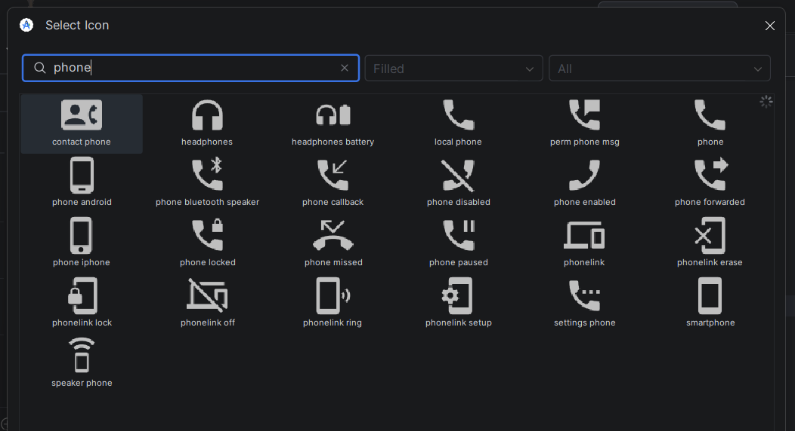

Y se usa con `painterResource`, igual que `Image`:

```kotlin
Icon(
    painter = painterResource(R.drawable.ic_phone),
    contentDescription = null, // el número de al lado ya dice que es un teléfono
    modifier = Modifier.size(24.dp),
    tint = MaterialTheme.colorScheme.primary
)
```

Recordad el truco del ejercicio 3: el `R` que hay que importar es el **del paquete de vuestra app**.

¿Por qué es la opción recomendada?

- **No añade dependencias**: no hay que tocar Gradle.
- El APK solo lleva **los iconos que usáis**, ni uno más.
- El `.xml` es un **vectorial**: se describe con formas, no con píxeles, así que se ve nítido a cualquier tamaño y en cualquier densidad de pantalla. Por eso va en `drawable` y no en `drawable-nodpi`.
- Es la vía que recomienda Google hoy para los iconos.

¿La pega? Hay que importarlos de uno en uno. Para los tres o cuatro de la tarjeta, eso no es nada.

#### Opción 2: la librería `material-icons-core`

Si preferís escribir `Icons.Default.Phone` como en el *codelab*, hay que añadir la librería al proyecto. En `gradle/libs.versions.toml`, dentro de `[libraries]`:

```toml
androidx-compose-material-icons-core = { group = "androidx.compose.material", name = "material-icons-core" }
```

No lleva versión porque la pone el **Compose BOM**. Si al sincronizar Gradle se queja de que falta, añadid `version = "1.7.8"`.

> [!NOTE]
> Las versiones se comprueban [buscando en Maven Central](https://mvnrepository.com/artifact/androidx.compose.material/material-icons-core/versions). La última estable es la 1.7.8 para *material-icons-core*.

Y en `app/build.gradle.kts`, dentro de `dependencies`:

```kotlin
implementation(libs.androidx.compose.material.icons.core)
```

Pulsad **Sync Now** y ya funciona el código del *codelab* (imports `androidx.compose.material.icons.Icons` y `androidx.compose.material.icons.filled.Phone`):

```kotlin
Icon(
    imageVector = Icons.Default.Phone,
    contentDescription = null,
    modifier = Modifier.size(24.dp),
    tint = MaterialTheme.colorScheme.primary
)
```

- A favor: el autocompletado de `Icons.Default.` es muy cómodo y la librería es pequeña.
- En contra: solo trae un **conjunto básico** de unos 50 iconos (`Phone`, `Email`, `Share`, `Person`, `LocationOn`, `Home`…). Para la tarjeta sobra, pero en cuanto necesitéis algo menos común no estará. Además, Google **ya no la actualiza**: los *Material Icons* han dado paso a los *Material Symbols*.

#### Opción 3 (desaconsejada): `material-icons-extended`

Existe una versión "extendida" de la anterior con **todos** los iconos de Material (miles, en las variantes `Filled`, `Outlined`, `Rounded`, `Sharp` y `TwoTone`). Se añade igual que la opción 2, cambiando `material-icons-core` por `material-icons-extended`.

Para una prueba rápida y furiosa, en la que queréis un icono raro ya y sin pensar, es tentadora. Pero no la uséis en un proyecto de verdad:

- Es **enorme**: alarga bastante cada compilación.
- En *debug* no se aplica R8 (la herramienta que elimina el código que no se usa), así que **el APK engorda mucho** por unos pocos iconos.
- Igual que la `core`, está **congelada**: Google ya no la actualiza.

Si solo necesitáis un icono que no está en la `core`, la opción 1 os lo da sin ninguno de estos problemas.

### Cómo entregarlo

Dentro de vuestra organización de GitHub, cread un repo **privado** llamado `T03-ej5` y subid el proyecto.

**Trucazo**: para crear repos como un misil, considera instalar **GitHub CLI**. Desde la carpeta del proyecto (ya inicializado con `git` y con al menos un *commit*) lo creas y subes sin pasar por la web:

```bash
gh repo create ORG_NAME/T03-ej5 --private --source=. --remote=origin --push
```

Si lo has completado todo, ¡enhorabuena! Tiene muchísimo mérito arrancar con esto porque hay tantos componentes y atributos que abruma.

Para tu tranquilidad, es normal que al principio no tengas del todo claro por qué pasan las cosas, pero poco a poco irás entendiendo el paradigma declarativo y Jetpack Compose.